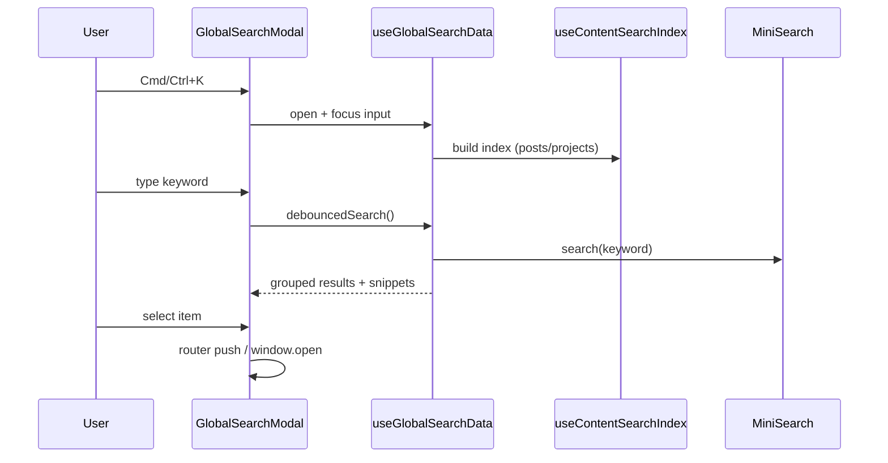

Search is a “small” feature that instantly makes a content-heavy site feel premium—especially once you have more than a handful of posts/projects.

For this portfolio, my global search has two non-negotiables:

1. **Keyboard-first** (Cmd/Ctrl+K to open, Escape to close)
2. **Section-aware** (search inside Markdown headings/sections, not just titles)

> All code details are available in the [GitHub repository](https://github.com/andy820621/portfolio-2024).

## Why MiniSearch

MiniSearch fits the constraints of this project:

- **Client-only, no services**: no Algolia/Meilisearch; works on Netlify + SSG without extra infra
- **Inverted index + decent ranking**: not just `includes()`, but BM25 scoring with configurable fuzzy/prefix options
- **Good extensibility without heavy complexity**: store fields for snippets/highlights and customize tokenization if needed

A quick comparison of common options:

| Option                | Best for                                              | Why I picked (or skipped) it                                                                            |
| --------------------- | ----------------------------------------------------- | ------------------------------------------------------------------------------------------------------- |
| MiniSearch            | Small/medium content, controllable full-text indexing | Fits perfectly with minimal cost                                                                        |
| Fuse.js               | Small datasets, fuzzy matching over arrays            | Becomes linear scan as data grows; section indexing is doable but less controllable than inverted index |
| FlexSearch            | Extreme performance, more language configuration      | Possible, but configuration/tuning cost is higher than needed here                                      |
| Algolia / Meilisearch | Large sites, search as a product                      | Requires extra services/cost/maintenance; doesn’t match the “zero dependency” goal                      |

## `queryCollectionSearchSections`

Nuxt Content provides [`queryCollectionSearchSections`](https://content.nuxt.com/docs/utils/query-collection-search-sections) which splits a document into multiple “sections” by headings.

In `app/composables/useContentSearchIndex.ts`:

- fetch sections via `queryCollectionSearchSections(collectionKey)`
- map them into documents with a stable `documentPath` (used to link back to list cards)
- build a `MiniSearch` index

Core mapping logic:

```ts
// app/composables/useContentSearchIndex.ts
const result = await queryCollectionSearchSections(collection.value)
  .where('published', '=', true)

return result.map(section => ({
  ...section,
  // section.id looks like: /posts/xxx#some-heading
  // documentPath maps to list cards (no hash)
  documentPath: normalizePath(section.id.split('#')[0] || ''),
}))
```

MiniSearch configuration (excerpt):

```ts
// app/composables/useContentSearchIndex.ts
const instance = new MiniSearch<ContentSearchSection>({
  idField: 'id',
  fields: ['title', 'titles', 'content'],
  storeFields: ['id', 'title', 'titles', 'level', 'content', 'documentPath'],
  searchOptions: {
    prefix: true,
    fuzzy: 0.2,
  },
})
```

Because `storeFields` includes `content`, we can build snippets and highlights without extra fetching.

## One modal, multiple result types

Global search isn’t only “content search”. It also includes:

- **posts** (by sections)
- **projects** (by sections)
- **navigation** (Home / Posts / Projects / Demos / Gallery)
- **quick actions** (theme toggle, language switch, contact/github/instagram)

Results are grouped and sorted by simple scoring rules so the UI stays predictable. (See `app/composables/useGlobalSearchData.ts`.)

## Ranking and scoring rules

### Content results (posts/projects)

Posts and projects are ranked by MiniSearch with:

- **fields**: `title`, `titles`, `content`
- **searchOptions**: `prefix: true`, `fuzzy: 0.2`
- **boost**: currently none (so fields are weighted equally)

So we directly use `section.score`:

```ts
// app/composables/useGlobalSearchData.ts (excerpt)
return createResultPayload({
  // ...
  score: section.score || 0,
}, keyword)
```

### Navigation results

Navigation doesn’t use MiniSearch; it uses simple text matching:

```ts
const term = keyword.toLowerCase()
const typeLabel = TYPE_META.nav.label.toLowerCase() // "navigation"
const matchesTypeLabel = typeLabel.includes(term)

return navLinks.value
  .filter((link) => {
    if (matchesTypeLabel)
      return true
    return link.title.toLowerCase().includes(term)
      || link.description.toLowerCase().includes(term)
  })
  .map(link => createResultPayload({
    // ...
    score: link.title.toLowerCase() === term ? 140 : 100,
    // ...
  }, keyword))
```

**Score rules:**

- If the keyword contains “navigation”, show all nav items
- Exact title match → score 140
- Partial title/description match → score 100

### Quick actions

Quick actions use the same matching logic as navigation:

```ts
const term = keyword.toLowerCase()
const typeLabel = TYPE_META.action.label.toLowerCase() // "quick actions"
const matchesTypeLabel = typeLabel.includes(term)

return quickActions.value
  .filter((action) => {
    if (matchesTypeLabel)
      return true
    return action.title.toLowerCase().includes(term)
      || action.description.toLowerCase().includes(term)
  })
  .map(action => createResultPayload({
    // ...
    score: 90, // fixed
    // ...
  }, keyword))
```

**Score rule:** fixed 90

### Final sorting

All sources are aggregated, sorted by score desc, and capped to 30 results:

```ts
const MAX_RESULTS = 30
const aggregatedResults = searchSources.flatMap(source => source.search(keyword))

results.value = aggregatedResults
  .sort((a, b) => b.score - a.score)
  .slice(0, MAX_RESULTS)
```

The UI then renders groups in a fixed order (Posts → Projects → Navigation → Actions) so content always appears first.

### Score distribution (roughly)

- **Navigation exact match**: 140 (highest)
- **MiniSearch**: algorithm-based (often ~50–100+)
- **Navigation partial match**: 100
- **Quick actions**: 90 (lowest)

## UX: search modal details

`app/components/GlobalSearchModal.vue` uses Headless UI’s dialog + combobox to handle:

- focus management (auto-focus input on open)
- keyboard up/down navigation
- auto-close on route changes (avoid stale state)
- internal navigation vs external links (`window.open`)

It also:

- highlights keyword with `<mark>...</mark>`
- builds snippets around the match so users see context immediately

## Snippets with context (not “summaries”)

The goal of a snippet is not to summarize an entire paragraph, but to show **why this result matches**.

Current rules (in `buildSnippet()` inside `useGlobalSearchData.ts`):

1. If keyword isn’t found: take the first 140 chars (add `...` if truncated)
2. If found: take **40 chars before** + **keyword** + **60 chars after**
3. If truncated (not from start / not to end), add `...`

```ts
// app/composables/useGlobalSearchData.ts
const index = lowerContent.indexOf(lowerKeyword)

if (index === -1)
  return content.length > 140 ? `${content.slice(0, 140)}...` : content

const start = Math.max(0, index - 40)
const end = Math.min(content.length, index + keyword.length + 60)

let snippet = content.slice(start, end)
if (start > 0)
  snippet = `...${snippet}`
if (end < content.length)
  snippet = `${snippet}...`
return snippet
```

Some edge cases (current behavior):

- **Multi-word query**: `indexOf()` searches the whole query string as-is; if not found, it falls back to “first 140 chars”
- **Multiple hits in the same section**: only the first hit is used
- **Highlight guard**: to avoid noise, keywords shorter than 2 chars don’t get `<mark>` highlighting

## Empty query state

This global search isn’t “blank by default”. Instead, it shows suggestions:

- **Navigation**: main pages (Home / Posts / Projects / Demos / Gallery)
- **Quick actions**: toggle theme, switch language, and external links (Email / GitHub / Instagram)

UI logic in `GlobalSearchModal.vue`:

- query is empty and `hasSuggestions` is true → show suggestions
- only when suggestions don’t exist (rare) → show placeholder text

## Flow (simplified)



## i18n-aware by default

Because indexes use `collectionKey = <folder>_<locale>`, switching language switches the index automatically—no special branching required.
The modal even offers “Switch language” as a quick action.

## Recommended reading

- [Projects & Gallery image pipeline: generated JSON maps, metadata, and LightBox integration](/posts/image-management-pipeline)
