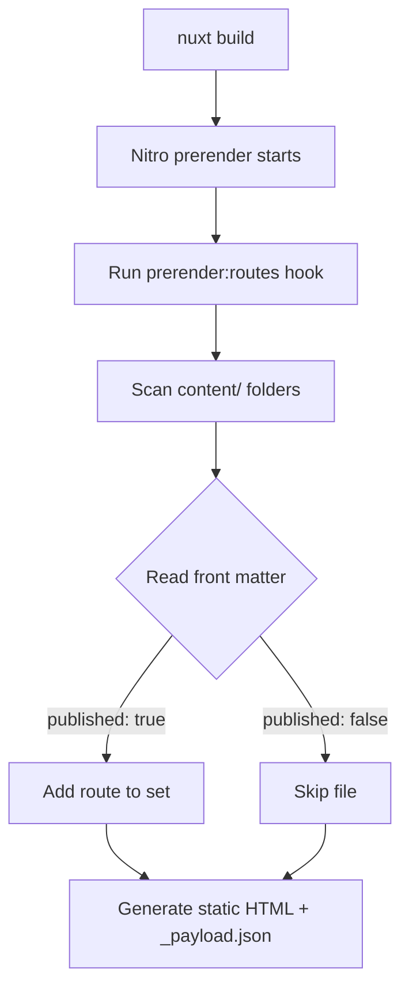

## Why content sites benefit from prerendering

For portfolios and blogs (where content changes relatively slowly), **prerendering to static HTML** brings clear performance and SEO wins:

- **Faster TTFB**: users worldwide can fetch complete HTML directly from a CDN
- **Simpler caching**: no need to handle dynamic content cache invalidation
- **More crawler-friendly**: bots get full content without executing JavaScript
- **More reliable sitemaps**: you know all routes at build time, so fewer blind spots

---

## The challenge of dynamic routes

Routes like `/posts/[slug]` and `/projects/[slug]` are **dynamic**. At build time, Nitro can’t know which slugs actually exist unless you tell it.

### What goes wrong if you do nothing?

If you only rely on `prerender: { crawlLinks: true }`, you’ll often run into:

1. **Missing “orphan pages”**: posts/projects not linked from list pages won’t be discovered/prerendered
2. **Draft leaks**: documents with `published: false` can still be crawled accidentally
3. **i18n route confusion**: bilingual content can produce incorrect URL combinations

### My solution

**Scan Markdown folders at build time**, explicitly add all routes that should exist, and exclude drafts during scanning.

> This post focuses on “Nitro prerender + draft filtering + deployment verification”. If you want the bilingual content system first (collections/schema and list/detail queries), read:
>
> - [Bilingual Nuxt Content v3 + i18n](/posts/nuxt-content-v3-i18n-bilingual-site)
>
> Full code is available in the [GitHub repository](https://github.com/andy820621/portfolio-2024).

---

## Architecture: from build to output



### Key steps

1. **Nitro prerender starts**: reads `prerender.routes` from `nuxt.config.ts`
2. **Hook execution**: the `prerender:routes` hook runs
3. **Filesystem scan**: walks Markdown files under `content/en/` and `content/zh/`
4. **Front matter check**: reads `published`
5. **Route generation**: derives routes by locale + content type (`/posts/slug` or `/zh/posts/slug`)
6. **Static output**: each route generates `index.html` and `_payload.json`

---

## Nitro config: the basics

Start by setting up Nitro prerender rules in `nuxt.config.ts`:

```ts
// nuxt.config.ts
export default defineNuxtConfig({
  nitro: {
    prerender: {
      // In production, relax errors so a single 404 won’t break the whole build
      failOnError: process.env.NODE_ENV !== 'production',

      // Crawl links as a supplement (useful, but not sufficient)
      crawlLinks: true,

      // Base static routes: indexes, home, etc.
      routes: [
        '/', // English home
        '/zh', // Chinese home
        '/posts', // English posts index
        '/zh/posts', // Chinese posts index
        '/projects', // English projects index
        '/zh/projects', // Chinese projects index
      ],

      // Exclude routes that should never be prerendered
      ignore: [
        '/api/_content', // Content query API
        '/api/**', // all API endpoints
        '/__nuxt_content/**', // internal Content routes
      ],
    },
  },
})
```

### Why `crawlLinks: true` isn’t enough

Nitro can crawl `<a>` links, but it has limitations:

- **Order dependency**: list pages must render first before detail pages are discoverable
- **Hard draft control**: you can’t exclude drafts before crawling happens
- **Orphan pages**: unlinked content is still missed

So **explicitly scanning the filesystem is more reliable**.

---

## Core implementation: the `prerender:routes` hook

Add route-scanning logic under `nitro.hooks` in `nuxt.config.ts`:

```ts
// nuxt.config.ts
export default defineNuxtConfig({
  nitro: {
    // ... prerender config above

    hooks: {
      'prerender:routes': async function (routes: Set<string>) {
        console.log('🔍 Start scanning content routes...')

        try {
          const fs = await import('node:fs/promises')
          const path = await import('node:path')
          const { fileURLToPath } = await import('node:url')

          const __dirname = fileURLToPath(new URL('.', import.meta.url))
          const contentDir = path.join(__dirname, 'content')

          // Scan all Markdown files under the given folder
          async function scanContentDir(
            dir: string,
            locale: string,
            type: string,
          ): Promise<string[]> {
            try {
              const files = await fs.readdir(dir, { withFileTypes: true })
              const routes: string[] = []

              for (const file of files) {
                const fullPath = path.join(dir, file.name)

                // Recurse subfolders
                if (file.isDirectory()) {
                  routes.push(...(await scanContentDir(fullPath, locale, type)))
                  continue
                }

                // Only handle .md files
                if (!file.name.endsWith('.md'))
                  continue

                // === draft filtering ===
                const shouldSkip = await checkIfDraft(fullPath, fs)
                if (shouldSkip) {
                  console.log(`⏭️  Skip draft: ${file.name}`)
                  continue
                }

                const slug = file.name.replace(/\\.md$/, '')
                const routePath = locale === 'en'
                  ? `/${type}/${slug}` // en: /posts/article-name
                  : `/zh/${type}/${slug}` // zh: /zh/posts/article-name

                routes.push(routePath)
              }

              return routes
            }
            catch (error) {
              console.error(`❌ Scan failed: ${dir}`, error)
              return []
            }
          }

          // Scan all content types in parallel
          const [postsEn, postsZh, projectsEn, projectsZh] = await Promise.all([
            scanContentDir(path.join(contentDir, 'en', 'posts'), 'en', 'posts'),
            scanContentDir(path.join(contentDir, 'zh', 'posts'), 'zh', 'posts'),
            scanContentDir(path.join(contentDir, 'en', 'projects'), 'en', 'projects'),
            scanContentDir(path.join(contentDir, 'zh', 'projects'), 'zh', 'projects'),
          ])

          const contentRoutes = [
            ...postsEn,
            ...postsZh,
            ...projectsEn,
            ...projectsZh,
          ]

          contentRoutes.forEach(route => routes.add(route))

          console.log(`✅ Added ${contentRoutes.length} content routes`)
        }
        catch (error) {
          console.error('❌ Nitro hook failed:', error)
        }
      },
    },
  },
})
```

---

## Draft filtering: safely reading front matter

I use a **lightweight string parser**: only read the `published` field from YAML front matter, without parsing the entire document.

### Implementation

```ts
async function checkIfDraft(
  filePath: string,
  fs: typeof import('node:fs/promises'),
): Promise<boolean> {
  try {
    const content = await fs.readFile(filePath, 'utf8')

    if (!content.startsWith('---'))
      return false

    const lines = content.split(/\\r?\\n/)

    for (let i = 1; i < lines.length; i++) {
      const line = lines[i]?.trim() || ''

      if (line === '---')
        break

      if (line.toLowerCase().startsWith('published:')) {
        const value = line
          .split(':')[1]
          ?.trim()
          .replace(/^['"]|['"]$/g, '')
          .toLowerCase()

        return value === 'false'
      }
    }

    return false
  }
  catch (error) {
    console.warn(`⚠️  Cannot read file: ${filePath}`)
    return false
  }
}
```

### Design considerations

1. **Fault tolerance first**: if reading fails, default to “published” to avoid accidentally dropping real content
2. **Performance**: stop as soon as `published` is found; don’t parse everything
3. **Compatibility**: supports `published: false` and `published: "false"`

---

## Netlify deployment: dealing with locale prefix issues

### Problem scenario

With `@nuxtjs/i18n` using `prefix_except_default`:

- English (default locale): no prefix → `/posts/article`
- Chinese: with prefix → `/zh/posts/article`

But users/crawlers can still generate invalid URLs:

- `/en/posts/article` (English should not have `/en`)
- `/zh/en/posts/article` (double prefix)
- `/zh/zh/posts/article` (wrong duplication)

### Solution: Netlify redirects

In `netlify.toml`, use permanent redirects (308):

```toml
# Redirect /en/* to /* (English is the default locale)
[[redirects]]
from = "/en/*"
to = "/:splat"
status = 308
force = true

# Fix accidental double-locale paths
[[redirects]]
from = "/zh/en/*"
to = "/zh/:splat"
status = 308
force = true

[[redirects]]
from = "/zh/zh/*"
to = "/zh/:splat"
status = 308
force = true
```

### Benefits

- **Cleaner canonical URLs**: one piece of content → one URL
- **Better SEO**: avoids duplicate content issues
- **Better UX**: shared/bookmarked wrong links still land on the correct page

---

## Verification: ensure every route is prerendered

### Why a test script?

The most common prerender failure mode is: **“the build looks successful, but some routes were never generated.”**

Typical causes:

- bugs in the hook logic cause files to be skipped
- incorrect path computation generates routes that don’t exist
- draft filtering is too strict and drops real content

### Test script design

Create `scripts/test-prerender.js`:

```js
import { readdir } from 'node:fs/promises'
import { join } from 'node:path'
import { fileURLToPath } from 'node:url'

const __dirname = fileURLToPath(new URL('.', import.meta.url))
const outputDir = join(__dirname, '../.output/public')

async function findHtmlFiles(dir, baseDir = dir) {
  const entries = await readdir(dir, { withFileTypes: true })
  const files = []

  for (const entry of entries) {
    const fullPath = join(dir, entry.name)

    if (entry.isDirectory()) {
      files.push(...await findHtmlFiles(fullPath, baseDir))
    }
    else if (entry.name.endsWith('.html')) {
      files.push(fullPath.replace(baseDir, '').replace(/\\\\/g, '/'))
    }
  }

  return files
}

async function checkPrerender() {
  console.log('🔍 Checking prerender output...\\n')

  try {
    const htmlFiles = await findHtmlFiles(outputDir)

    const stats = {
      posts: htmlFiles.filter(f =>
        f.includes('/posts/') && !f.includes('/posts/index.html'),
      ),
      projects: htmlFiles.filter(f =>
        f.includes('/projects/') && !f.includes('/projects/index.html'),
      ),
      zhPosts: htmlFiles.filter(f =>
        f.includes('/zh/posts/') && !f.includes('/zh/posts/index.html'),
      ),
      zhProjects: htmlFiles.filter(f =>
        f.includes('/zh/projects/') && !f.includes('/zh/projects/index.html'),
      ),
    }

    console.log('📊 Prerender stats:')
    console.log(`   EN posts: ${stats.posts.length}`)
    console.log(`   EN projects: ${stats.projects.length}`)
    console.log(`   ZH posts: ${stats.zhPosts.length}`)
    console.log(`   ZH projects: ${stats.zhProjects.length}`)
    console.log(`   Total pages: ${htmlFiles.length}\\n`)

    const hasPayload = htmlFiles.some(f => f.includes('_payload.json'))
    console.log(`✅ Payload extraction: ${hasPayload ? 'OK' : '❌ missing'}`)

    const totalContent = stats.posts.length + stats.projects.length
      + stats.zhPosts.length + stats.zhProjects.length
    if (totalContent < 5) {
      console.warn('\\n⚠️  Warning: prerendered content count is unexpectedly low; check the hook logic')
    }
  }
  catch (error) {
    console.error('❌ Check failed:', error)
    process.exit(1)
  }
}

checkPrerender()
```

### How to run

Add a script in `package.json`:

```json
{
  "scripts": {
    "build": "nuxt build",
    "test:prerender": "node scripts/test-prerender.js"
  }
}
```

Run verification:

```bash
pnpm build
pnpm test:prerender
```

Expected output:

```
🔍 Checking prerender output...

📊 Prerender stats:
   EN posts: 12
   EN projects: 5
   ZH posts: 12
   ZH projects: 5
   Total pages: 47

✅ Payload extraction: OK
```

---

## What the build output looks like

After a successful prerender, `.output/public/` looks like:

```
.output/public/
├── index.html                    # English home
├── zh/
│   └── index.html                # Chinese home
├── posts/
│   ├── index.html                # English posts index
│   ├── article-1/
│   │   ├── index.html            # post page
│   │   └── _payload.json         # Nuxt payload
│   └── article-2/
│       ├── index.html
│       └── _payload.json
├── projects/
│   ├── index.html                # English projects index
│   └── portfolio-2024/
│       ├── index.html            # project page
│       └── _payload.json
└── zh/
    ├── posts/
    │   ├── index.html            # Chinese posts index
    │   └── article-1/
    │       ├── index.html
    │       └── _payload.json
    └── projects/
        ├── index.html
        └── portfolio-2024/
            ├── index.html
            └── _payload.json
```

Each route produces:

- `index.html`: the full HTML page
- `_payload.json`: Nuxt hydration payload

---

## End-to-end workflow summary

### Development

1. Add Markdown files under `content/`
2. Use `published: false` to mark drafts
3. In local dev, drafts are still viewable by visiting the route directly

### Build

1. Run `nuxt build`
2. Nitro triggers the `prerender:routes` hook
3. The hook scans all Markdown and filters `published: false`
4. Static HTML is generated under `.output/public/`
5. Run `test:prerender` to verify output

### Deployment

1. Push to the Git repository
2. Netlify triggers a build automatically
3. Static assets are deployed to CDN
4. Redirect rules fix accidental locale-prefix URLs

---

## Further reading

This post is part of the “Nuxt 4 portfolio series”:

- [Bilingual Nuxt Content v3 + i18n](/posts/nuxt-content-v3-i18n-bilingual-site) — collections and schema design
- [Global search: MiniSearch + Nuxt Content search sections](/posts/global-fulltext-search) — how prerendered content becomes searchable
- [Practical SEO in Nuxt 4: Schema.org, sitemap, OG images, and validation](/posts/nuxt-seo-guide) — how prerendering fits into SEO

---

## Summary

With Nitro’s `prerender:routes` hook, you can:

- **automate route generation**
- **manage drafts safely**
- **verify output deterministically**
- **stay SEO-friendly**

This makes content releases more controllable and lays a solid foundation for sitemaps and search indexing.
