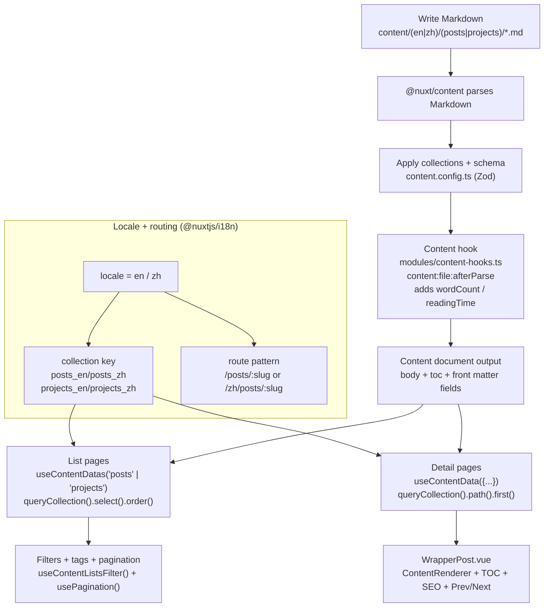

Markdown is fast and intuitive—but **once your content grows, unstructured Markdown becomes a maintenance burden**.

In this portfolio project, I treat the content system like a “product module”, not just a pile of articles. This post explains how I use **Nuxt Content v3 + i18n + collections + schema** to build a system that is:

- predictable and consistent (front matter shape stays stable)
- cleanly bilingual (en/zh split, consistent routing strategy)
- reusable (list/detail pages share the same data pipeline)
- naturally extensible to SEO, search, and prerendering

> Everything here comes from a real, running project. Full code is available in the [GitHub repository](https://github.com/andy820621/portfolio-2024).

---

## Quick tour: folders and data flow

Before diving into collections/schemas, here’s where content lives and how it flows into pages.

### Folder structure (relevant to this post)

```text
.
├─ content/
│  ├─ en/
│  │  ├─ posts/            # /posts/:slug
│  │  ├─ projects/         # /projects/:slug
│  │  └─ demos/            # /demos/:slug
│  └─ zh/
│     ├─ posts/            # /zh/posts/:slug
│     ├─ projects/         # /zh/projects/:slug
│     └─ demos/            # /zh/demos/:slug
├─ app/
│  ├─ pages/
│  │  ├─ posts/
│  │  │  ├─ index.vue      # posts list
│  │  │  └─ [post].vue     # post detail
│  │  └─ projects/
│  │     ├─ index.vue      # projects list
│  │     └─ [project].vue  # project detail
│  ├─ composables/
│  │  ├─ useContentDatas.ts
│  │  ├─ useContentData.ts
│  │  ├─ useContentListsFilter.ts
│  │  └─ usePagination.ts
│  └─ components/
│     └─ WrapperPost.vue   # detail layout (header/toc/share/prev-next)
├─ modules/
│  └─ content-hooks.ts     # content:file:afterParse (wordCount/readingTime)
├─ scripts/
│  └─ test-prerender.js    # verify prerender output
├─ content.config.ts       # collections + zod schema
└─ nuxt.config.ts          # i18n + content toc/anchor + nitro prerender
```

### Data flow (Markdown → Content → Page)



---

## Why content collections are non-negotiable

Nuxt Content v3 **collections** are the backbone of this content architecture.

In `content.config.ts`, I split collections by “content type × locale”:

- `posts_en` / `posts_zh`: blog posts
- `projects_en` / `projects_zh`: projects
- `demos_en` / `demos_zh`: demos
- `content_en` / `content_zh`: static pages (About, License, …)

Each collection defines a `prefix`, which maps directly to your route base:

- English (default): `/posts/<slug>` (no `/en` prefix)
- Chinese: `/zh/posts/<slug>`

This aligns naturally with `@nuxtjs/i18n` using `prefix_except_default`—**locale, route strategy, and folder structure stay consistent**.

---

## Zod schema: make Markdown reliable

As content grows, relying on “free-form front matter” becomes risky.

In `content.config.ts`, I define nearly identical schemas for `posts` and `projects` (with Zod):

- **required**: `date`, `tags`, `published`
- **optional**: `title`, `description`, `image`, `ogImage`, `categories`, `updatedAt`, ...

This gives real benefits:

1. field mistakes are caught early when authoring
2. list/detail pages can share the same types and `select()` fields safely
3. SEO/search/sitemap don’t need defensive checks everywhere

> Schema turns Markdown from “free text” into “typed content data”.

---

## Reading time and word count: compute it in the Content hook

Manually maintaining reading time is brittle.

In `modules/content-hooks.ts`, I use the `content:file:afterParse` hook:

- input: `content.body`
- output: `content.wordCount`, `content.readingTime`

And I estimate speed differently by locale:

- Chinese: ~326 WPM
- English: ~183 WPM

So:

- Markdown stays clean (no extra fields)
- both list pages and detail pages can display reading time consistently
- locale differences are baked into the calculation

---

## List pages: one data pipeline, reused everywhere

UX differs between `/posts` and `/projects`, but the data pipeline is nearly identical.

I split the logic into three composables:

1. `useContentDatas(folderName)`: query the collection and normalize the output
2. `useContentListsFilter()`: full-text search + tag filtering
3. `usePagination()`: pagination

The only real difference is `folderName`, which keeps behavior consistent and maintenance cost low.

---

## Detail pages: one document + prev/next navigation

Post/project detail pages share the same strategy:

- derive the collection key from the current locale
- fetch the document by path
- compute prev/next by `date`

The UI is handled by a shared layout component: `WrapperPost.vue`, which includes:

- cover, date, tags, reading time
- TOC (from `body.toc.links`)
- smooth hash scrolling (with an offset)
- social share and prev/next navigation

Authors focus on writing; layouts and behaviors stay consistent.

---

## Mermaid in Markdown (direct rendering)

This project uses my package [**@barzhsieh/nuxt-content-mermaid**](https://www.npmjs.com/package/@barzhsieh/nuxt-content-mermaid),
so Markdown ` ```mermaid ` blocks render directly as SVG diagrams.

That makes technical posts much easier to read, because architecture and flowcharts can live naturally inside Markdown.

---

## Closing: treat content as a product system

When your site is small, Markdown feels like “anything goes”.
But for a long-lived content product, **structure and constraints actually make creation more free**.

Nuxt Content v3 collections and hooks let content scale naturally into SEO, search, prerendering, and build automation—an excellent fit for maintainable, content-driven products.

---

### Further reading

- [Prerendering dynamic Markdown routes with Nitro hooks](/posts/nitro-prerender-dynamic-routes-solution)
- [Building a Nuxt 4 portfolio as a product](/posts/nuxt4-portfolio-architecture)
