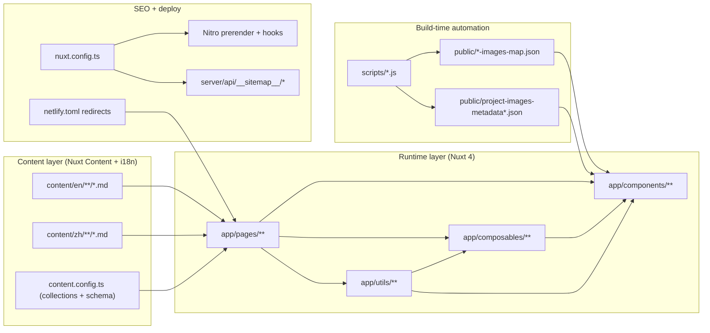

## From “looks good” to “easy to maintain”

In past portfolio projects, I poured most effort into visual polish—but ignored a painful truth: **how hard is it to keep the content updated?**

Every new post or project update felt like defusing a bomb: fix one thing, break another; add a feature, and SEO needs rewiring again.
That “every page reinvents the wheel” style turns a portfolio into a one-off showcase—not a product that can grow.

So I set clear goals for this project:

- Adding/updating content must be fast and version-controlled
- Routes should be prerenderable, with an automated verification flow
- SEO should be generated systematically (no hand-written meta tag chaos)
- Search should work across Markdown sections/paragraphs
- Images/media should have a pipeline (no manual bookkeeping)

This post explains the high-level architecture and the DX decisions behind the site.

> All implementation details are in the [GitHub repository](https://github.com/andy820621/portfolio-2024).

---

## Why Nuxt?

I chose Nuxt mainly because its ecosystem is strong and flexible—especially for content and SEO:

- **Built-in content management**: [@nuxt/content](https://content.nuxtjs.org/) lets me manage everything in Markdown, and a Zod schema keeps the data shape consistent.
- **SEO tooling**: [@nuxtjs/seo](https://nuxt.com/modules/seo) provides practical modules (sitemap, robots.txt, Open Graph, etc.), so SEO stays systematic instead of scattered.
- **SSR & prerender**: Great performance and SEO while still keeping static deployments convenient.
- **Modular architecture**: Nuxt modules make it easy to extend without dumping everything into one file—important for long-term maintenance.
- **TypeScript support**: Strong TS integration improves reliability through static checks.
- **Nitro**: Nitro makes deployment flexible (Netlify, Vercel, Cloudflare Pages, and more).

---

## High-level architecture

I break the site into four layers, each with clear responsibilities:

### 1) Content layer

The `content/` directory stores Markdown for both locales (`en/` and `zh/`), and `content.config.ts` defines collections + schemas.

### 2) Runtime layer

The `app/` directory contains pages/components/composables to query data, render UI, and handle interactions.

### 3) Build automation

Scripts under `scripts/` generate image maps, metadata, and prerender checks to keep the output correct and complete.

### 4) SEO + deployment

`nuxt.config.ts`, `server/`, and `netlify.toml` handle Nitro prerender, sitemap endpoints, redirects, and platform configuration.

---

## Content: from ad-hoc to systematic

### Markdown for everything

I use [@nuxt/content](https://content.nuxtjs.org/) as the content core, with a goal of “systematic scaling” instead of “one-off hacks”.

**Design principles:**

- Bilingual content separation via `content/en/**` and `content/zh/**`
- List pages and detail pages share querying logic via composables
- TOC, reading time, and section indexing are generated by the Content pipeline

That lets me focus on the content itself, not repetitive implementation details.

> Deep dive: [Bilingual Nuxt Content v3 + i18n](/posts/nuxt-content-v3-i18n-bilingual-site)

### Composables as the “single source of truth”

Instead of scattering query/formatting/SEO logic across pages, I centralize it in `app/composables/`:

- **`useContentDatas()`** — list page fetching + normalization
- **`useContentData()`** — detail page document + prev/next navigation
- **`useContentListsFilter()`** — search text + tag filters
- **`useContentSearchIndex()` / `useGlobalSearchData()`** — global search indexing + querying

Two practical benefits:

1. **Consistent behavior**: all pages share the same data pipeline
2. **Safer changes**: change one place, update everything

### Reusable UI components

I also built reusable UI blocks that “productize” the experience:

**WrapperPost.vue**
Combines header, TOC, social share, prev/next navigation, and smooth hash scrolling.

**GlobalSearchModal.vue**
Keyboard-first search UI (`Cmd/Ctrl+K`), with shortcuts and instant results.

**FiltersBar.vue**
Shared filtering UI for all list pages, with consistent tag/search interactions.

**RandomBackground.vue**
Dynamic background variations to keep the site feeling fresh.

---

## Further reading

This post is the overview. These posts dive into specific subsystems:

- [Bilingual Nuxt Content v3 + i18n](/posts/nuxt-content-v3-i18n-bilingual-site)
- [Global search with MiniSearch + Nuxt Content](/posts/global-fulltext-search)
- [Projects/Gallery image pipeline: JSON maps, metadata, and LightBox](/posts/image-management-pipeline)
- [Prerendering dynamic Markdown routes with Nitro hooks](/posts/nitro-prerender-dynamic-routes-solution)

---

## Summary

A maintainable portfolio isn’t about flashy tricks. It’s about:

1. **Systematic content management** — making new content easy
2. **Clear encapsulation** — reducing duplication and keeping behavior consistent
3. **Solid automation** — automate anything repeatable
4. **SEO + performance** — not only “pretty”, but also discoverable

With these decisions, I can spend time creating content instead of fighting technical debt. If you’re building your own portfolio, I hope this architecture helps.
