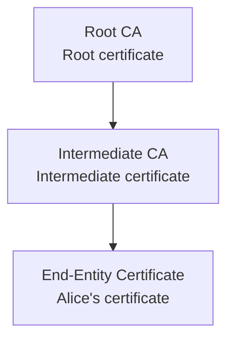

## Introduction

When you transfer money via online banking, sign a contract on your phone, or notice the little lock icon in your browser’s address bar, you might not think about how that “invisible trust” is established.

In the digital world, we interact with strangers every day and still feel safe sending passwords or credit card numbers. Technically, anyone who intercepts a packet could read your data. So why do we still dare to use it?

Because there’s a complete trust mechanism working behind the scenes—called Public Key Infrastructure (PKI).

---

## Why we need encryption and trust

In the early days of the internet, data was transmitted in clear text. Anyone intercepting the traffic could read the content. Encryption was introduced to fix this.

### Symmetric vs. asymmetric encryption

Symmetric encryption (e.g., AES) is fast and easy to implement, but both parties must share a secret key in advance, which can be stolen during exchange.
Asymmetric encryption (e.g., RSA, ECC) uses a key pair—a public key and a private key. The public key can be shared openly, while the private key must be kept secret. No prior secret exchange is required, enabling secure communication.

::LightBoxUrls{:urls='["https://www.ssl2buy.com/wp-content/uploads/2015/12/Symmetric-Encryption.png", "https://www.ssl2buy.com/wp-content/uploads/2015/12/Asymmetric-Encryption.png"]'}
::

---

## What PKI is and the problems it solves

PKI’s goal is to securely bind every public key to a verifiable identity, and to maintain trust through certificate issuance, management, and revocation.

Concretely, it takes care of:

- Issuing and managing digital certificates
- Managing the certificate lifecycle (issuance, renewal, revocation)
- Ensuring both parties in communication can securely verify each other’s identity

---

## Core roles in PKI

To make the system reliable, PKI involves several key roles:

- CA (Certificate Authority)
  Issues, signs, and revokes certificates; the root of trust.

- RA (Registration Authority)
  Verifies applicants’ identities before issuance (think of it as the CA’s front-line verifier).

- Repository (certificate store and status services)
  Stores issued certificates and provides CRL/OCSP status services.

- Policy & Procedures
  Define who can obtain which certificate, renewal frequency, and revocation procedures to ensure transparency.

---

## How PKI works

Let’s walk through a real-world scenario to understand the full PKI flow.

### Scenario: Alice submits a digitally signed contract to a bank

#### 1. Alice obtains a digital certificate

- Applies to a CA (e.g., DigiCert)
- After identity verification by the RA, the CA issues a certificate containing Alice’s public key
- Alice’s private key remains only on her device

#### 2. Alice signs the contract

- Compute a hash of the contract using SHA-256
- Encrypt the hash with her private key to generate a signature
- Send “contract + signature + certificate” to the bank

#### 3. The bank verifies

Signature verification:

- Use Alice’s public key to verify the signature
- Recompute the contract’s hash and compare → confirms it hasn’t been tampered with

Certificate chain verification:
When verifying the certificate, the bank walks up the chain of trust step by step (see the illustration under “Chain of Trust and Trust Anchor”).

Certificate status check:

- Use OCSP/CRL to ensure it hasn’t been revoked and is still within its validity period

#### 4. Verification complete

✅ The contract was signed by Alice
✅ The content hasn’t been altered
✅ Identity verified by a CA

---

## PKI essentials

### Digital certificates and the X.509 standard

A digital certificate is like an “ID card for a public key,” following the X.509 standard.

#### X.509 v3 core fields

| Field               | Description                                  |
| ------------------- | -------------------------------------------- |
| Version             | Typically v3 today                           |
| Serial Number       | Unique identifier assigned by the CA         |
| Signature Algorithm | e.g., sha256WithRSAEncryption                |
| Issuer              | Name of the issuing CA                       |
| Validity            | Not Before / Not After                       |
| Subject             | Distinguished name of the certificate holder |
| Subject Public Key  | Public key algorithm and data                |

> Common v3 extensions include Key Usage, SAN (Subject Alternative Name), etc. See RFC 5280: https://datatracker.ietf.org/doc/html/rfc5280

---

### Chain of Trust and Trust Anchor

When verifying a certificate, the system doesn’t just trust Alice’s certificate directly—it validates the entire chain of trust:

At the top, the Root CA is the starting point of the entire trust chain—the Trust Anchor. If you trust this root certificate, you can trust all certificates it ultimately issues.

> 💡 Example: When you open an HTTPS website, your browser validates the entire chain and ultimately checks whether the Root CA is in its trusted root store.

Why use Intermediate CAs?

- A Root CA’s private key is extremely sensitive and usually kept offline
- Intermediate CAs handle day-to-day issuance; if compromised, only that tier needs to be revoked, leaving the Root CA intact
- Provides more flexible management and separation of duties

---

### Certificate status checking (CRL vs. OCSP)

Even within the validity period, a certificate can become invalid due to private key compromise or organizational revocation. PKI offers two main ways to check status:

| Method | Full name                          | How it works                                                                                     | Pros/Cons                                                                                     |
| ------ | ---------------------------------- | ------------------------------------------------------------------------------------------------ | --------------------------------------------------------------------------------------------- |
| CRL    | Certificate Revocation List        | The CA periodically publishes a list of revoked certificates; clients download and check locally | ✅ Simple and reliable ❌ Lists can be large; updates aren’t real-time                    |
| OCSP   | Online Certificate Status Protocol | Query the CA in real time for a single certificate’s status                                      | ✅ Real-time and lightweight ❌ Requires network availability; potential privacy concerns |

> 💡 Most modern browsers primarily use OCSP. If the query fails, they may soft-fail to avoid breaking user experience.

---

## Public vs. private PKI

PKI generally falls into two categories for different use cases:

| Type        | Use case                                         | CA source                       | Examples                                                   |
| ----------- | ------------------------------------------------ | ------------------------------- | ---------------------------------------------------------- |
| Public PKI  | External services, public website HTTPS          | Publicly trusted commercial CAs | Let's Encrypt, DigiCert, GlobalSign                        |
| Private PKI | Internal enterprise auth, VPN, device management | Enterprise-run internal CAs     | Active Directory Certificate Services, OpenSSL self-signed |

### When to use a private PKI

- Employee authentication inside an organization
- Mutual authentication for IoT devices
- TLS for internal systems
- VPN certificate management

Private PKI gives you full control, but only systems that trust your internal CA can validate its certificates.

---

## Who oversees CAs?

If CAs are a root of trust, who ensures they don’t abuse their power?

### Oversight mechanisms

1. CA/Browser Forum
   - Jointly defines requirements by CAs and browser vendors
   - Sets operational standards and audit requirements

2. Browser vendors’ trust stores
   - Chrome, Firefox, Safari, etc. maintain their own “trusted root CA” lists
   - CAs must pass rigorous audits to be included

3. Independent audits and certifications
   - CAs undergo periodic WebTrust or ETSI audits
   - Demonstrate compliance with security and operational standards

4. Certificate Transparency (CT)
   - All publicly issued certificates must be logged in public, append-only logs
   - Anyone can monitor for suspicious issuances

---

## PKI in action

You likely use PKI every day—often without noticing:

- 🔒 HTTPS: authenticity and transport encryption for websites
- 📧 S/MIME: email signing and encryption
- 🧾 Document and code signing (PDFs, apps)
- 🧠 IoT and enterprise identity (VPN, single sign-on, device auth)

---

## Practical tips and extras

### Want to see PKI in your browser?

In Chrome or Edge:

1. Click the lock/settings icon in the address bar
2. Chrome: “Connection is secure” → “Certificate is valid”
   Edge: “Connection is secure” → click the “Show certificate” icon
3. You’ll see the site’s certificate, issuing CA, and the chain of trust.

### Common crypto and signature algorithms

| Category              | Algorithms              | Notes                                                                       |
| --------------------- | ----------------------- | --------------------------------------------------------------------------- |
| Symmetric encryption  | AES                     | Fast; great for bulk data                                                   |
| Asymmetric encryption | RSA, ECC (e.g., P‑256)  | Secure but slower; best for small payloads                                  |
| Signature algorithms  | RSA‑PSS, ECDSA, Ed25519 | Sign a hash with a private key; verify with the public key; non-repudiation |
| Hash algorithms       | SHA‑256, SHA‑3          | One-way; fixed-length fingerprint                                           |

> 💡 Different scenarios call for different combinations—there’s no silver bullet, only the best fit.

### Why so many algorithms?

#### Performance vs. security trade-offs

| Scenario                          | Needs                                  | Common choice              |
| --------------------------------- | -------------------------------------- | -------------------------- |
| Mobile/IoT (resource-constrained) | Low power, fast compute                | ECC (e.g., P‑256, Ed25519) |
| Servers/enterprise systems        | Security-first                         | RSA‑2048, RSA‑4096         |
| High-assurance (gov/military)     | Long-term, post-quantum considerations | SHA‑3, Ed448               |

#### Different purposes (encrypt, sign, verify)

| Category                             | Purpose                                     | Why not interchangeable                                  |
| ------------------------------------ | ------------------------------------------- | -------------------------------------------------------- |
| Symmetric encryption (AES)           | Protect data at rest/in transit efficiently | Requires a shared secret; not suitable for open exchange |
| Asymmetric encryption (RSA/ECC)      | Key exchange or identity                    | Slower; not for bulk data                                |
| Signature algorithms (ECDSA/Ed25519) | Verify origin and integrity                 | Different from encryption; focuses on non-repudiation    |
| Hash algorithms (SHA‑256)            | Produce irreversible fingerprints           | Integrity only; not encryption                           |

> 💡 Example in HTTPS/TLS:
>
> Use RSA/ECDHE for key exchange (asymmetric)
> Use AES for data transport (symmetric)
> Use SHA‑256 for integrity (hash)
> These appear together in a TLS cipher suite.

---

## Conclusion

Encryption makes secure transport possible, but trust is what makes security meaningful.

PKI isn’t just certificates or a single technology—it’s the process and framework built on public/private keys that underpins internet security. It lets us exchange information, sign documents, and establish connections in a world where we can’t see each other.

In this era where identity equals security, PKI is the cornerstone of digital trust—and the prerequisite for encryption to truly work.

---

## References

- Wikipedia: Public Key Infrastructure — https://en.wikipedia.org/wiki/Public_key_infrastructure
- IDManagement.gov: Public Key Infrastructure 101 — https://www.idmanagement.gov/university/pki/
- Okta: What Is Public Key Infrastructure — https://www.okta.com/identity-101/public-key-infrastructure/
- Keyfactor: What is PKI? — https://www.keyfactor.com/education-center/what-is-pki/
- CA/Browser Forum Baseline Requirements — https://cabforum.org/baseline-requirements-documents/
