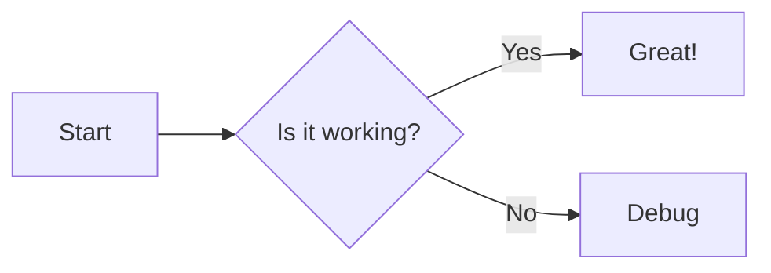

## Project Overview

This module integrates [**Nuxt Content v3**](https://content.nuxt.com/docs/getting-started){target="\_blank" rel="noopener"} and [**Mermaid**](https://mermaid.js.org/){target="\_blank" rel="noopener"}.
It automatically turns Mermaid fenced code blocks (\`\`\`mermaid) in Markdown into a responsive diagram component, with lazy loading and dark/light theme switching built in.

## Problems It Solves

In Nuxt Content, Mermaid often requires you to manually handle the whole pipeline: “parse Markdown → transform → load Mermaid on the client → render”, while also taking care of:

- SSR & hydration (Mermaid can only render on the client)
- Stability & performance when rendering many diagrams on the same page
- Dark/light theme switching
- Mermaid exposes many configuration options, but wiring them into Nuxt Content isn’t very intuitive

This module packages the above into a “content transformer + runtime component” so authors can focus on the Markdown itself.

## Features

- **Automatic transform**: Converts Mermaid fenced code blocks into `<Mermaid>` during the `content:file:beforeParse` hook.
- **Lazy loading**: Uses `IntersectionObserver` by default; Mermaid is loaded and rendered only when the component enters the viewport.
- **Theme integration**: If `@nuxtjs/color-mode` is installed, Mermaid themes automatically follow `dark/light`; `useMermaidTheme()` is also available for manual control.
- **Customizable components**: Supports custom renderer / spinner / error components.
- **Runtime config**: Allows overriding settings at deploy time via `runtimeConfig.public.contentMermaid`.
- **Front matter override**: Supports a `config` field in page front matter to override Mermaid settings per document.
- **TypeScript support**: Full TypeScript definitions for both the module and runtime components.
- **Test coverage**: Unit tests written with Vitest to keep the module stable.

## How It Works (Simplified)

````mermaid
---
toolbar:
  title: nuxt-content-mermaid Basic Flow
---
flowchart TD
  MD["Write a<br><b>```mermaid</b> block<br>in Markdown"] --> Hook["Nuxt Content hook<br/><b>content:file:beforeParse</b>"]
  Hook --> Comp["Output a <Mermaid> component"]
  Comp --> Plugin["Client plugin provides $mermaid()"]
  Plugin --> Import["dynamic import('mermaid')"]
  Import --> Render["mermaid.run() generates SVG"]
````

## Quick Start

1. Install:

```bash
pnpm add -D @barzhsieh/nuxt-content-mermaid
```

2. Add it to `nuxt.config.ts`:

```ts
export default defineNuxtConfig({
  modules: ['@barzhsieh/nuxt-content-mermaid', '@nuxt/content'],
  contentMermaid: {
    theme: { light: 'default', dark: 'dark' },
    // loader: { lazy: true, init: { securityLevel: 'strict' } },
  },
})
```

3. Write Mermaid directly in Markdown:

````md

````

## Links

- NPM: [https://www.npmjs.com/package/@barzhsieh/nuxt-content-mermaid](https://www.npmjs.com/package/@barzhsieh/nuxt-content-mermaid){target="\_blank" rel="noopener"}
- GitHub: [https://github.com/andy820621/nuxt-content-mermaid](https://github.com/andy820621/nuxt-content-mermaid){target="\_blank" rel="noopener"}
