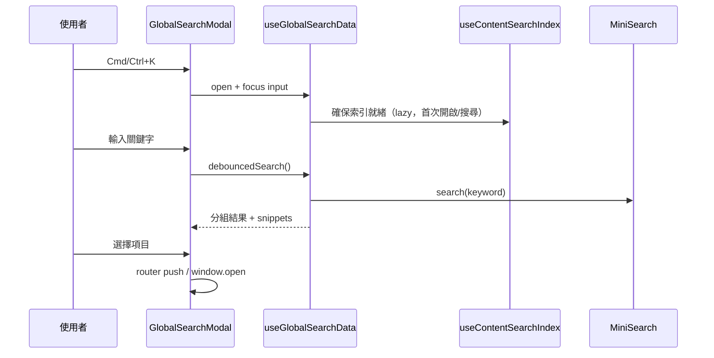

搜尋是一個很「小」但能瞬間拉高使用者體驗的功能：尤其是當內容量一多，沒有搜尋就很難快速找到想要的內容。

在這個作品集網站，我希望全站搜尋同時滿足：

1. **鍵盤優先**（Cmd/Ctrl+K 打開、Escape 關閉）
2. **章節/段落可被搜尋**（不是只搜尋文章標題）

> 以下所有程式碼細節都可以在 [GitHub Repository](https://github.com/andy820621/portfolio-2024) 找到。

## 為什麼選 MiniSearch

我選擇 MiniSearch 的原因是它剛好符合這個專案的約束：

- **純前端、零服務依賴**：不需要另外架設搜尋服務（像 Algolia/Meilisearch），部署到 Netlify/SSG 也能直接使用。
- **反向索引 + 可用的排名**：不是單純 `includes()`，而是有 scoring（BM25）與可調的 prefix/fuzzy 權重。
- **可擴充性夠、複雜度可控**：可以存 `storeFields`（用來做 snippet/高亮），也能視需求客製 tokenizer/processTerm。

簡單對比一下常見選項：

| 方案                  | 適合情境                               | 挑選與否的原因                                                          |
| --------------------- | -------------------------------------- | ----------------------------------------------------------------------- |
| MiniSearch            | 內容量中小、要可控的全文索引與排名     | 符合需求，成本最低                                                      |
| Fuse.js               | 小資料量、偏 fuzzy、通常直接對陣列搜尋 | 資料量變大時是線性掃描；做「分段索引」也可以，但效能/可控性不如反向索引 |
| FlexSearch            | 極致效能/多語系配置彈性更大            | 能做，但設定與調參成本更高（對這個專案而言偏重）                        |
| Algolia / Meilisearch | 大型站點、需要更完整的搜尋產品能力     | 需要額外服務/費用/維運；不符合我「零依賴」的部署目標                    |

## queryCollectionSearchSections

Nuxt Content 提供 [queryCollectionSearchSections](https://content.nuxt.com/docs/utils/query-collection-search-sections) API：
透過他可以把每篇文件依 heading 拆成多段索引。
在 `app/composables/useContentSearchIndex.ts`：

- 用 `queryCollectionSearchSections(collectionKey)` **按需拉 sections**
- 映射成有穩定 `documentPath` 的 documents（用來對應清單頁）
- **延遲建立** `MiniSearch` index（首次開啟 modal 或第一次搜尋），sections 透過 `useState` 快取，索引留在 module memory

下面是核心查詢邏輯：

```ts
// app/composables/useContentSearchIndex.ts
const result = await queryCollectionSearchSections(collection.value)
  .where('published', '=', true)

return result.map(section => ({
  ...section,
  // section.id 會長得像：/posts/xxx#some-heading
  // documentPath 用來對應清單卡片（不含 hash）
  documentPath: normalizePath(section.id.split('#')[0] || ''),
}))
```

[MiniSearch](https://lucaong.github.io/minisearch/) 的設定主要包含：

- fields：`title`, `titles`, `content`
- options：`prefix: true`, `fuzzy: 0.2`

因此你輸入半個詞也能得到合理結果，同時不會太容易噴出大量雜訊。

MiniSearch index 的配置（節錄）：

```ts
// app/composables/useContentSearchIndex.ts
const instance = new MiniSearch<ContentSearchSection>({
  idField: 'id',
  fields: ['title', 'titles', 'content'],
  storeFields: ['id', 'title', 'titles', 'level', 'content', 'documentPath'],
  searchOptions: {
    prefix: true,
    fuzzy: 0.2,
  },
})
```

`storeFields` 會把 `content`（段落文字）一起存起來，後續會用來做 snippet 與 hilight。

### 延遲初始化（效能）

索引不會在頁面載入時就建立，而是由 `ensureContentSearchReady()` 在「開啟搜尋 modal」或「第一次輸入搜尋」時準備完成，避免初始載入做重工。

## 一個 modal，聚合多種結果類型

全站搜尋不只有內容搜尋，會包含：

- **posts**（段落）
- **projects**（段落）
- **navigation**（站內導覽：home/posts/projects/demos/gallery）
- **quick actions**（切換主題、切換語言、contact/github/instagram）

結果會分組並用 scoring 排序，讓 UI 保持可預期。(細節可參考 `app/composables/useGlobalSearchData.ts`)

## 排序與 scoring 規則

### 內容結果（posts/projects）

posts 和 projects 的搜尋結果由 MiniSearch 處理。MiniSearch 的設定如下：

- **fields**：`title`, `titles`, `content`
- **searchOptions**：`prefix: true`, `fuzzy: 0.2`
- **boost**：目前未設定（所以各欄位沒有權重差異）

這表示 MiniSearch 會在這三個欄位中平等搜尋，score 由 MiniSearch 的內部演算法決定。每筆結果的 score 會直接使用 `section.score`，沒有額外加權：

```ts
// app/composables/useGlobalSearchData.ts (excerpt)
return createResultPayload({
  // ...
  score: section.score || 0,
}, keyword)
```

### Navigation 結果

Navigation 不使用 MiniSearch，而是直接文字匹配：

```ts
const term = keyword.toLowerCase()
const typeLabel = TYPE_META.nav.label.toLowerCase() // "navigation"
const matchesTypeLabel = typeLabel.includes(term)

return navLinks.value
  .filter((link) => {
    if (matchesTypeLabel)
      return true
    return link.title.toLowerCase().includes(term)
      || link.description.toLowerCase().includes(term)
  })
  .map(link => createResultPayload({
    // ...
    score: link.title.toLowerCase() === term ? 140 : 100,
    // ...
  }, keyword))
```

**score 規則**：

- 如果搜尋詞包含 "navigation"（不分大小寫），所有 nav 項目都會顯示
- 標題完全匹配搜尋詞（小寫後）→ score 140
- 標題或描述包含搜尋詞 → score 100

### Quick Actions 結果

Quick Actions 也是直接文字匹配，邏輯同 Navigation：

```ts
const term = keyword.toLowerCase()
const typeLabel = TYPE_META.action.label.toLowerCase() // "quick actions"
const matchesTypeLabel = typeLabel.includes(term)

return quickActions.value
  .filter((action) => {
    if (matchesTypeLabel)
      return true
    return action.title.toLowerCase().includes(term)
      || action.description.toLowerCase().includes(term)
  })
  .map(action => createResultPayload({
    // ...
    score: 90, // 固定 score
    // ...
  }, keyword))
```

**score 規則**：固定 90

### 最後的排序邏輯

所有來源的結果會聚合，然後依 score 降序排列，最多回傳 30 筆：

```ts
const MAX_RESULTS = 30
const aggregatedResults = searchSources.flatMap(source => source.search(keyword))

results.value = aggregatedResults
  .sort((a, b) => b.score - a.score)
  .slice(0, MAX_RESULTS)
```

UI 顯示時會再用固定的分組順序呈現（Posts → Projects → Navigation → Actions），確保內容結果在上方。

### Score 分布概況

- **Navigation 完全匹配**：140（優先度最高）
- **MiniSearch 結果**：由演算法決定（通常在 50-100+ 之間）
- **Navigation 部分匹配**：100
- **Quick Actions**：90（優先度最低）

## UX：搜尋 modal 的互動細節

`app/components/GlobalSearchModal.vue` 使用 Headless UI 的 dialog + combobox 來封裝成：

- focus 管理（開啟時自動 focus input）
- 鍵盤上下選擇結果
- route 變更時自動關閉（避免狀態殘留）
- 內部導頁 vs 外部連結（`window.open`）

另外也會：

- 用 `<mark>...</mark>` 高亮關鍵字
- 依關鍵字位置截取 snippet，讓你看到上下文

## Snippet 如何保留上下文

snippet 的目的不是「摘要整段」，而是讓使用者看到「為什麼這筆命中」。

目前的實作規則很單純（在 `useGlobalSearchData.ts` 的 `buildSnippet()`）：

1. 找不到關鍵字時：取前 140 個字元（太長就加 `...`）
2. 找得到關鍵字時：取 **關鍵字前 40** + **關鍵字本身** + **關鍵字後 60**
3. 若有截斷（不是從 0 開始/不是到結尾）就補 `...`

```ts
// app/composables/useGlobalSearchData.ts
const index = lowerContent.indexOf(lowerKeyword)

if (index === -1)
  return content.length > 140 ? `${content.slice(0, 140)}...` : content

const start = Math.max(0, index - 40)
const end = Math.min(content.length, index + keyword.length + 60)

let snippet = content.slice(start, end)
if (start > 0)
  snippet = `...${snippet}`
if (end < content.length)
  snippet = `${snippet}...`
return snippet
```

幾個你可能會在意的邊界情況（目前的行為）：

- **多關鍵字查詢**：`indexOf()` 是找「整個 query」在內容中的第一次出現；如果找不到，就回退到「前 140 字」的策略
- **同一段落多次命中**：只會取第一次命中的位置
- **高亮條件**：為了避免太吵，keyword 長度 < 2 不做 `<mark>` 高亮（可以在程式碼裡看到這個 guard）

## 空搜尋狀態

這個全站搜尋不是「一打開就空白」，也不是「最近瀏覽」；目前設計是提供兩種建議（Suggestions）：

- **Navigation**：站內主要頁面（Home / Posts / Projects / Demos / Gallery）
- **Quick Actions**：切換主題、切換語言、以及外部連結（Email / GitHub / Instagram）

對應的 UI 判斷在 `GlobalSearchModal.vue`：

- `query` 為空且 `hasSuggestions` 為 true → 顯示建議列表
- 若沒有 suggestions（幾乎不會發生）才會顯示 placeholder 文字

## 簡易邏輯流程



## 預設就支援 i18n

因為索引使用 `collectionKey = <folder>_<locale>`，所以語系切換就等於切換索引，不需要額外的分支邏輯。
搜尋 modal 甚至提供「切換語言」的 quick action。

## 推薦閱讀

- [Projects/Gallery 圖片管線：JSON map、metadata 與 LightBox 整合](/zh/posts/image-management-pipeline)
