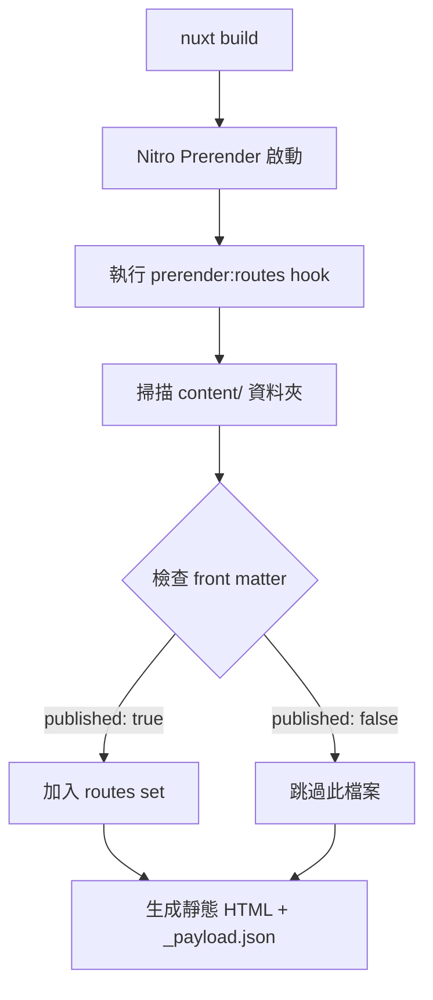

## 為什麼內容型網站需要預渲染

對於作品集、部落格這類內容更新頻率較低的網站，**預渲染（prerender）成靜態 HTML** 能帶來顯著的效能與 SEO 優勢:

- **TTFB 更快**: 全球任何地點都能從 CDN 直接取得完整 HTML
- **快取策略更簡單**: 不需要處理動態內容的快取失效問題
- **SEO 更友善**: 爬蟲直接拿到完整內容，不需要執行 JavaScript
- **Sitemap 更可靠**: 建置時就知道所有頁面，不會有遺漏

---

## 動態路由的挑戰

問題在於像 `/posts/[slug]` 和 `/projects/[slug]` 這樣的**動態路由**，建置時 Nitro 無法自動知道「有哪些 slug 真的存在」。

### 不處理會發生什麼?

如果你只設定 `prerender: { crawlLinks: true }`，會遇到以下問題:

1. **遺漏孤島頁面**: 沒有被任何清單頁連結到的文章不會被預渲染
2. **草稿洩漏**: 設定 `published: false` 的文章仍可能被爬到
3. **i18n 路由混亂**: 雙語內容可能產生錯誤的 URL 組合

### 我的解決方案

**建置時主動掃描 Markdown 資料夾**，把所有應該被預渲染的路由明確告訴 Nitro，並在過程中排除草稿。

> 本文會聚焦在「Nitro prerender + 草稿過濾 + 部署驗證」。如果你想先理解雙語內容系統的設計(collections/schema、清單/詳情頁如何查詢)，建議先閱讀:
>
> - [透過 Nuxt Content v3 與 i18n 建立可長期維護的雙語內容網站](/zh/posts/nuxt-content-v3-i18n-bilingual-site)
>
> 完整程式碼可在 [GitHub Repository](https://github.com/andy820621/portfolio-2024) 查看。

---

## 整體架構: 從建置到輸出



### 關鍵步驟說明

1. **Nitro Prerender 啟動**: 讀取 `nuxt.config.ts` 中的 `prerender.routes`
2. **Hook 執行**: `prerender:routes` hook 被觸發
3. **檔案系統掃描**: 遍歷 `content/en/` 和 `content/zh/` 下的 Markdown
4. **Front matter 解析**: 讀取每個檔案的 `published` 欄位
5. **路由生成**: 依語系和內容類型組合路由 (`/posts/slug` 或 `/zh/posts/slug`)
6. **靜態產物**: 每個路由產生對應的 `index.html` 和 `_payload.json`

---

## Nitro 配置: 基礎設定

首先在 `nuxt.config.ts` 設定 prerender 的基本規則:

```ts
// nuxt.config.ts
export default defineNuxtConfig({
  nitro: {
    prerender: {
      // 在 production 環境放寬錯誤檢查，避免單一 404 導致整個 build 失敗
      failOnError: process.env.NODE_ENV !== 'production',

      // 自動爬取頁面中的連結(作為補充，但不能完全依賴)
      crawlLinks: true,

      // 靜態路由:清單頁、首頁等固定頁面
      routes: [
        '/', // 英文首頁
        '/zh', // 中文首頁
        '/posts', // 英文文章清單
        '/zh/posts', // 中文文章清單
        '/projects', // 英文專案清單
        '/zh/projects', // 中文專案清單
      ],

      // 排除不需要預渲染的路徑
      ignore: [
        '/api/_content', // Content query API
        '/api/**', // 所有 API endpoints
        '/__nuxt_content/**', // Content 內部路由
      ],
    },
  },
})
```

### 為什麼「crawlLinks: true」 不夠?

雖然 Nitro 能爬取頁面中的 `<a>` 連結，但這種方式有幾個問題:

- **順序依賴**: 必須等清單頁先被渲染，才能發現詳情頁
- **草稿控制困難**: 無法在爬取前就排除 `published: false` 的文章
- **孤島頁面遺漏**: 沒有被任何頁面連結到的內容會被忽略

因此**主動掃描檔案系統是更可靠的方案**。

---

## 核心實作: Prerender Hook

在 `nuxt.config.ts` 的 `nitro.hooks` 中加入路由掃描邏輯:

```ts
// nuxt.config.ts
export default defineNuxtConfig({
  nitro: {
    // ... 前面的 prerender 設定

    hooks: {
      'prerender:routes': async function (routes: Set<string>) {
        console.log('🔍 開始掃描內容路由...')

        try {
          const fs = await import('node:fs/promises')
          const path = await import('node:path')
          const { fileURLToPath } = await import('node:url')

          const __dirname = fileURLToPath(new URL('.', import.meta.url))
          const contentDir = path.join(__dirname, 'content')

          // 掃描指定資料夾的所有 Markdown 檔案
          async function scanContentDir(
            dir: string,
            locale: string,
            type: string
          ): Promise<string[]> {
            try {
              const files = await fs.readdir(dir, { withFileTypes: true })
              const routes: string[] = []

              for (const file of files) {
                const fullPath = path.join(dir, file.name)

                // 遞迴處理子資料夾
                if (file.isDirectory()) {
                  routes.push(...(await scanContentDir(fullPath, locale, type)))
                  continue
                }

                // 只處理 .md 檔案
                if (!file.name.endsWith('.md'))
                  continue

                // === 草稿過濾邏輯 ===
                const shouldSkip = await checkIfDraft(fullPath, fs)
                if (shouldSkip) {
                  console.log(`⏭️  跳過草稿: ${file.name}`)
                  continue
                }

                const slug = file.name.replace(/\.md$/, '')
                const routePath = locale === 'en'
                  ? `/${type}/${slug}` // 英文: /posts/article-name
                  : `/zh/${type}/${slug}` // 中文: /zh/posts/article-name

                routes.push(routePath)
              }

              return routes
            }
            catch (error) {
              console.error(`❌ 掃描失敗: ${dir}`, error)
              return []
            }
          }

          // 平行掃描所有內容類型
          const [postsEn, postsZh, projectsEn, projectsZh] = await Promise.all([
            scanContentDir(path.join(contentDir, 'en', 'posts'), 'en', 'posts'),
            scanContentDir(path.join(contentDir, 'zh', 'posts'), 'zh', 'posts'),
            scanContentDir(path.join(contentDir, 'en', 'projects'), 'en', 'projects'),
            scanContentDir(path.join(contentDir, 'zh', 'projects'), 'zh', 'projects'),
          ])

          const contentRoutes = [
            ...postsEn,
            ...postsZh,
            ...projectsEn,
            ...projectsZh
          ]

          contentRoutes.forEach(route => routes.add(route))

          console.log(`✅ 成功加入 ${contentRoutes.length} 個內容路由`)
        }
        catch (error) {
          console.error('❌ Nitro Hook 執行失敗:', error)
        }
      },
    },
  },
})
```

---

## 草稿過濾: 如何安全地解析 Front Matter

我採用**輕量級的字串解析**: 只讀取 YAML front matter 中的 `published` 欄位，不需要完整解析整個文件。

### 實作邏輯

```ts
async function checkIfDraft(
  filePath: string,
  fs: typeof import('node:fs/promises')
): Promise<boolean> {
  try {
    const content = await fs.readFile(filePath, 'utf8')

    if (!content.startsWith('---'))
      return false

    const lines = content.split(/\r?\n/)

    for (let i = 1; i < lines.length; i++) {
      const line = lines[i]?.trim() || ''

      if (line === '---')
        break

      if (line.toLowerCase().startsWith('published:')) {
        const value = line
          .split(':')[1]
          ?.trim()
          .replace(/^['"]|['"]$/g, '')
          .toLowerCase()

        return value === 'false'
      }
    }

    return false
  }
  catch (error) {
    console.warn(`⚠️  無法讀取檔案: ${filePath}`)
    return false
  }
}
```

### 設計考量

1. **容錯性優先**: 讀取失敗時預設為「已發布」，避免誤刪正常內容
2. **效能考量**: 只解析到 `published` 欄位就停止，不需要讀取整個檔案
3. **相容性**: 支援 `published: false` 和 `published: "false"` 兩種寫法

---

## Netlify 部署: 處理語系前綴問題

### 問題情境

由於使用 `@nuxtjs/i18n` 的 `prefix_except_default` 策略:

- 英文(預設語言):網址不帶前綴 `/posts/article`
- 中文:網址帶語系前綴 `/zh/posts/article`

但使用者/爬蟲可能產生錯誤的 URL:

- `/en/posts/article` (不應該存在的英文前綴)
- `/zh/en/posts/article` (重複前綴)
- `/zh/zh/posts/article` (錯誤重複)

### 解決方案: Netlify Redirects

在 `netlify.toml` 中設定永久重導向(308):

```toml
# 所有 /en/* 重導向到 /*
[[redirects]]
from = "/en/*"
to = "/:splat"
status = 308
force = true

# 處理錯誤的雙重前綴
[[redirects]]
from = "/zh/en/*"
to = "/zh/:splat"
status = 308
force = true

[[redirects]]
from = "/zh/zh/*"
to = "/zh/:splat"
status = 308
force = true
```

### 好處

- **Canonical URL 更乾淨**: 避免同一內容有多個網址
- **SEO 友善**: 不會有重複內容(duplicate content)問題
- **使用者體驗**: 分享連結或書籤出錯時，自動導向正確版本

---

## 驗證機制: 確保所有路由都被預渲染

### 為什麼需要測試腳本?

Prerender 最容易發生的問題是**「看起來成功，但某些路由沒產出」**。

常見原因:

- Hook 邏輯有 bug，某些檔案被跳過
- 路徑計算錯誤，產生不存在的路由
- 草稿過濾太嚴格，誤刪正常內容

### 測試腳本設計

建立 `scripts/test-prerender.js`:

```js
import { readdir } from 'node:fs/promises'
import { join } from 'node:path'
import { fileURLToPath } from 'node:url'

const __dirname = fileURLToPath(new URL('.', import.meta.url))
const outputDir = join(__dirname, '../.output/public')

async function findHtmlFiles(dir, baseDir = dir) {
  const entries = await readdir(dir, { withFileTypes: true })
  const files = []

  for (const entry of entries) {
    const fullPath = join(dir, entry.name)

    if (entry.isDirectory()) {
      files.push(...await findHtmlFiles(fullPath, baseDir))
    }
    else if (entry.name.endsWith('.html')) {
      files.push(fullPath.replace(baseDir, '').replace(/\\/g, '/'))
    }
  }

  return files
}

// 主要檢查邏輯
async function checkPrerender() {
  console.log('🔍 檢查預渲染輸出...\n')

  try {
    const htmlFiles = await findHtmlFiles(outputDir)

    const stats = {
      posts: htmlFiles.filter(f =>
        f.includes('/posts/') && !f.includes('/posts/index.html')
      ),
      projects: htmlFiles.filter(f =>
        f.includes('/projects/') && !f.includes('/projects/index.html')
      ),
      zhPosts: htmlFiles.filter(f =>
        f.includes('/zh/posts/') && !f.includes('/zh/posts/index.html')
      ),
      zhProjects: htmlFiles.filter(f =>
        f.includes('/zh/projects/') && !f.includes('/zh/projects/index.html')
      ),
    }

    // 顯示結果
    console.log('📊 預渲染統計:')
    console.log(`   英文文章: ${stats.posts.length} 篇`)
    console.log(`   英文專案: ${stats.projects.length} 個`)
    console.log(`   中文文章: ${stats.zhPosts.length} 篇`)
    console.log(`   中文專案: ${stats.zhProjects.length} 個`)
    console.log(`   總計: ${htmlFiles.length} 個頁面\n`)

    // 檢查 payload 是否存在
    const hasPayload = htmlFiles.some(f => f.includes('_payload.json'))
    console.log(`✅ Payload extraction: ${hasPayload ? '正常' : '❌ 缺失'}`)

    // 警告:如果數量異常少
    const totalContent = stats.posts.length + stats.projects.length
      + stats.zhPosts.length + stats.zhProjects.length
    if (totalContent < 5) {
      console.warn('\n⚠️  警告: 預渲染的內容數量異常少,請檢查 hook 邏輯')
    }
  }
  catch (error) {
    console.error('❌ 檢查失敗:', error)
    process.exit(1)
  }
}

checkPrerender()
```

### 使用方式

在 `package.json` 加入腳本:

```json
{
  "scripts": {
    "build": "nuxt build",
    "test:prerender": "node scripts/test-prerender.js"
  }
}
```

執行驗證:

```bash
pnpm build
pnpm test:prerender
```

預期輸出:

```
🔍 檢查預渲染輸出...

📊 預渲染統計:
   英文文章: 12 篇
   英文專案: 5 個
   中文文章: 12 篇
   中文專案: 5 個
   總計: 47 個頁面

✅ Payload extraction: 正常
```

---

## 實際建置產物結構

成功預渲染後,`.output/public/` 的結構會是:

```
.output/public/
├── index.html                    # 英文首頁
├── zh/
│   └── index.html                # 中文首頁
├── posts/
│   ├── index.html                # 英文文章清單
│   ├── article-1/
│   │   ├── index.html            # 文章頁面
│   │   └── _payload.json         # Nuxt payload
│   └── article-2/
│       ├── index.html
│       └── _payload.json
├── projects/
│   ├── index.html                # 英文專案清單
│   └── portfolio-2024/
│       ├── index.html            # 專案詳情
│       └── _payload.json
└── zh/
    ├── posts/
    │   ├── index.html            # 中文文章清單
    │   └── article-1/
    │       ├── index.html
    │       └── _payload.json
    └── projects/
        ├── index.html
        └── portfolio-2024/
            ├── index.html
            └── _payload.json
```

每個路由都會產生:

- `index.html`:完整的 HTML 頁面
- `_payload.json`:Nuxt 的 hydration 資料

---

## 完整工作流程總結

### 開發階段

1. 在 `content/` 新增 Markdown 檔案
2. 設定 `published: false` 標記為草稿
3. 本地開發時,草稿仍可透過直接訪問路由查看

### 建置階段

1. 執行 `nuxt build`
2. Nitro 觸發 `prerender:routes` hook
3. Hook 掃描所有 Markdown,過濾 `published: false`
4. 產生靜態 HTML 到 `.output/public/`
5. 執行 `test:prerender` 驗證輸出

### 部署階段

1. 推送到 Git repository
2. Netlify 自動觸發建置
3. 部署靜態檔案到 CDN
4. Redirects 處理錯誤的語系前綴

---

## 延伸閱讀

這篇文章是「Nuxt 4 作品集系列」的一部分:

- [透過 Nuxt Content v3 與 i18n 建立可長期維護的雙語內容網站](/zh/posts/nuxt-content-v3-i18n-bilingual-site) - 了解 collections 與 schema 設計
- [全站搜尋怎麼做得好用:MiniSearch + Nuxt Content 分段索引](/zh/posts/global-fulltext-search) - 預渲染的內容如何建立搜尋索引
- [Nuxt 4 實戰 SEO:Schema.org、sitemap、OG images 與驗證工具](/zh/posts/nuxt-seo-guide) - 預渲染如何與 SEO 整合

---

## 總結

透過 Nitro 的 `prerender:routes` hook，我們可以:

- **自動化路由生成**
- **安全的草稿管理**
- **可驗證的輸出**
- **SEO 友善**

這套方案讓內容管理變得更可控，也為後續的 sitemap、搜尋索引等功能奠定穩固的基礎。
