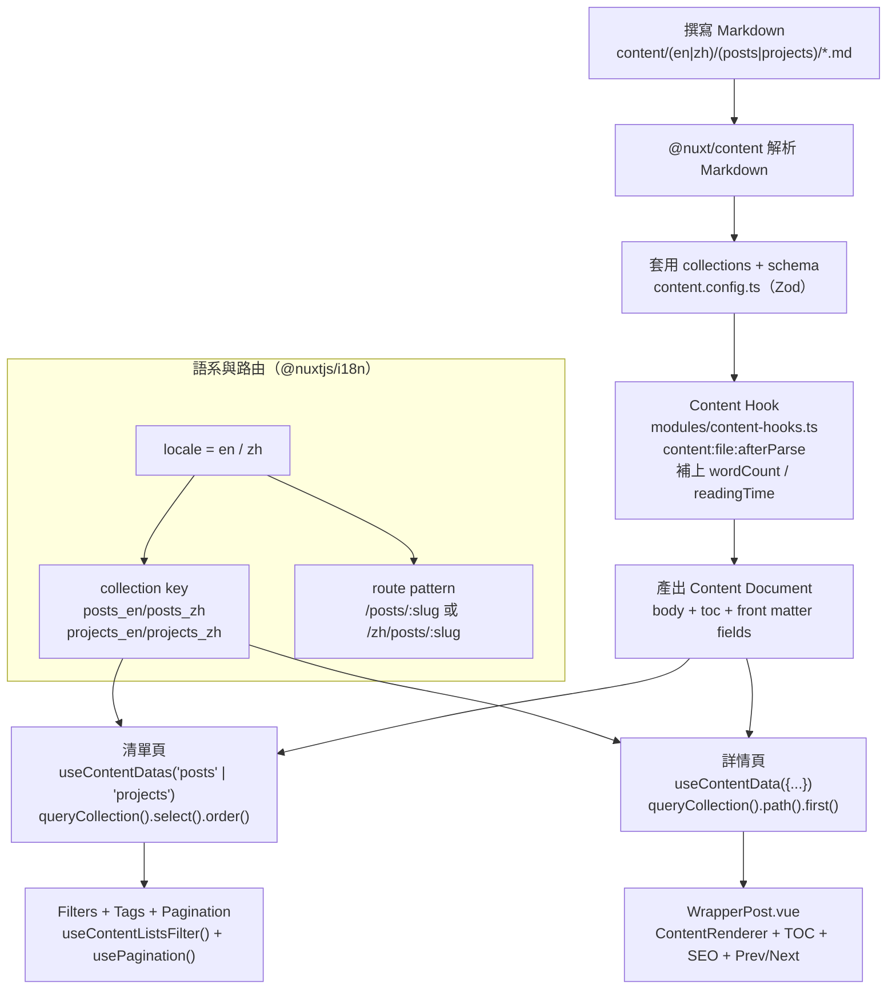

寫 Markdown 來管理內容快速又直覺，但**當內容開始成長，沒有結構的 Markdown 反而會成為維護上的負擔**。

在我的個人作品集專案中，我把內容系統當成一個「產品模組」來設計，而不是單純的文章集合。這篇文章會說明我如何透過 **Nuxt Content v3 + i18n + collections + schema**，建立一套：

- 結構一致、可預期的 front matter
- 中英文內容清楚分流、路由策略一致
- 清單頁與詳情頁可共用資料邏輯
- 能自然擴充到 SEO、搜尋與 prerender 的內容系統

> 本文所有實作都來自實際運作中的專案，都可以在 [GitHub Repository](https://github.com/andy820621/portfolio-2024) 查看完整程式碼。

---

## 快速導覽：資料夾結構與資料流

在開始講 collections/schema 之前，我先用兩張圖把「內容放哪裡」以及「資料怎麼流到頁面」交代清楚，後面你會更容易對照程式碼。

### 資料夾結構（與本文相關）

```text
.
├─ content/
│  ├─ en/
│  │  ├─ posts/            # /posts/:slug
│  │  ├─ projects/         # /projects/:slug
│  │  └─ demos/            # /demos/:slug
│  └─ zh/
│     ├─ posts/            # /zh/posts/:slug
│     ├─ projects/         # /zh/projects/:slug
│     └─ demos/            # /zh/demos/:slug
├─ app/
│  ├─ pages/
│  │  ├─ posts/
│  │  │  ├─ index.vue      # posts list
│  │  │  └─ [post].vue     # post detail
│  │  └─ projects/
│  │     ├─ index.vue      # projects list
│  │     └─ [project].vue  # project detail
│  ├─ composables/
│  │  ├─ useContentDatas.ts
│  │  ├─ useContentData.ts
│  │  ├─ useContentListsFilter.ts
│  │  └─ usePagination.ts
│  └─ components/
│     └─ WrapperPost.vue   # detail page layout (header/toc/share/prev-next)
├─ modules/
│  └─ content-hooks.ts     # content:file:afterParse (wordCount/readingTime)
├─ scripts/
│  └─ test-prerender.js    # verify prerender output
├─ content.config.ts       # collections + zod schema
└─ nuxt.config.ts          # i18n + content toc/anchor settings + nitro prerender
```

### 資料流程（Markdown → Content → Page）



---

## 為什麼一定要用 Content Collections

Nuxt Content v3 提供的 **collections**，是我整個內容架構的核心。

在 `content.config.ts` 中，我依照「內容類型 × 語言」拆分 collections：

- `posts_en` / `posts_zh`：部落格文章
- `projects_en` / `projects_zh`：專案說明
- `demos_en` / `demos_zh`：技術示範
- `content_en` / `content_zh`：靜態頁（About、License…）

每個 collection 都定義了 `prefix`，用來對應實際網址結構，例如：

- `/posts/<slug>`（英文為預設語系，不使用 `/en` 前綴）
- `/zh/posts/<slug>`

這樣的設計能自然對齊 `@nuxtjs/i18n` 的 `prefix_except_default` 策略，
**語系、路由與內容結構三者保持一致**，不需要額外轉換心智模型。

---

## 使用 Zod 定義 Schema 來約束 Markdown

隨著文章數量增加，文章的結構設計變得越來越重要，而不是僅僅依賴「自由格式的 front matter」。

因此我在 `content.config.ts` 中，替 `posts` 與 `projects` 定義了幾乎一致的 schema（使用 Zod）：

- **必填**：`date`、`tags`、`published`
- **選填**：`title`、`description`、`image`、`ogImage`、`categories`、`updatedAt`…

這樣做帶來的實際好處是：

1. 新增內容時立即發現欄位錯誤
2. 清單頁與詳情頁可直接共用同一套型別
3. SEO、搜尋、sitemap 不需要再做防呆判斷

> Schema 的存在，讓 Markdown 從「自由文字」升級為「有型別的內容資料」。

---

## 閱讀時間與字數：交給 Content Hook

閱讀時間如果靠人工維護，每次的更新都會需要調整，也容易忘記修改。

我在 `modules/content-hooks.ts` 使用 `content:file:afterParse` hook：

- 輸入：`content.body`
- 輸出：`content.wordCount`、`content.readingTime`

並依照語言調整估算速度：

- 中文：約 326 WPM
- 英文：約 183 WPM

這樣一來：

- Markdown 不需要多寫任何欄位
- 清單頁、詳情頁都能直接顯示閱讀時間
- 語系差異自然被納入計算

---

## 清單頁設計：一套資料邏輯，多個頁面共用

`/posts` 與 `/projects` 在 UX 上不同，但資料流程幾乎一致。

我把邏輯拆成三個 composables：

1. `useContentDatas(folderName)`：依 collection 取資料並 normalize
2. `useContentListsFilter()`：全文搜尋 + tags 篩選
3. `usePagination()`：分頁

差異只剩 `folderName`，
**讓內容頁面的行為一致，維護成本極低**。

---

## 詳情頁：單篇內容 + 前後文導航

文章與專案的詳情頁同樣共用一套資料策略：

- 依目前語系推導 collection key
- 依 path 取得單篇內容
- 依 `date` 取得 prev / next

UI 則由共用的 `WrapperPost.vue` 處理：

- 封面、日期、tags、reading time
- TOC（由 `body.toc.links` 生成）
- hash 平滑捲動（含 offset）
- 社群分享與前後文導覽

內容專注在寫作，版型與行為保持一致。

---

## 在 Markdown 中直接使用 Mermaid

這個專案使用我撰寫的套件 [**@barzhsieh/nuxt-content-mermaid**](https://www.npmjs.com/package/@barzhsieh/nuxt-content-mermaid)，
讓 Markdown 中的 ` ```mermaid ` 區塊直接渲染為 Svg。

這讓技術文章可以自然地加入流程圖、架構圖。

---

## 結語：把內容系統當成產品設計

當內容量還小時，Markdown 看起來「怎麼寫都可以」；
但當它變成長期維護的網站時，**結構與約束反而讓創作更自由**。

Nuxt Content v3 提供的 collections 與 hooks，
讓內容可以自然地延伸到 SEO、搜尋、prerender 與自動化流程，
非常適合用來打造真正可維護的內容型產品。

---

### 延伸閱讀

- [如何用 Nitro Hooks 解決 Nuxt Content 動態路由的預渲染問題](/zh/posts/nitro-prerender-dynamic-routes-solution)
- [以產品思維打造 Nuxt 4 個人網站](/zh/posts/nuxt4-portfolio-architecture)
