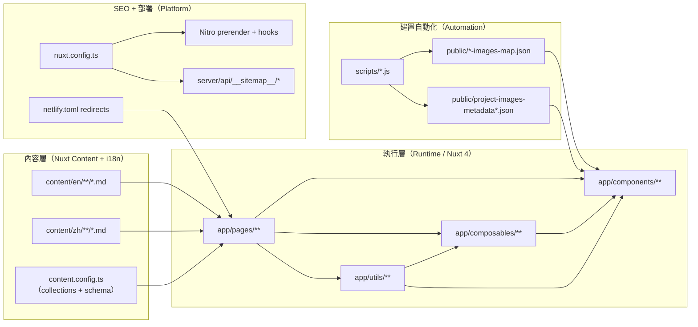

## 從「好看」到「好維護」

過去的作品集網站，我把大部分心力放在視覺設計上，卻忽略了一個關鍵問題：**內容更新有多痛苦？**

每次想加一篇文章或更新專案描述，都像在拆彈——改了這裡，那裡就壞了；加了新功能，SEO 又要重新調整。這種「各自為政」的開發方式，讓網站變成了一次性作品，而不是可以持續成長的產品。

因此我給自己設定了明確的目標：

- 內容新增/修改要快速，且能版本控管
- 路由可被預渲染，且測試流程自動化
- SEO 系統化產生，不再手寫一堆 meta tag
- 搜尋功能跨越 Markdown 段落/章節
- 圖片/媒體有自動化管線，告別手工整理

這篇文章會分享我如何設計整個專案架構，以及如何提升開發與維護體驗。

> 以下相關程式碼都可以在 [GitHub Repository](https://github.com/andy820621/portfolio-2024) 找到。

---

## 為什麼選擇 Nuxt？

我選擇 Nuxt 主要是因為它的生態系擁的豐富性和靈活性，特別是在內容管理和 SEO 方面，像是：

- **內建的內容管理**：[@nuxt/content](https://content.nuxtjs.org/) 讓我用 Markdown 管理所有內容，搭配 zod 所寫的 schema 確保資料結構一致。
- **SEO 支援**：[@nuxtjs/seo](https://nuxt.com/modules/seo) 提供了多種 SEO 工具 (ex: sitemap、robots.txt、Open Graph 等)，讓 SEO 配置系統化而非零散化。
- **SSR & prerender**：Nuxt 的伺服器端渲染和預渲染功能，讓網站在效能和 SEO 上都有優異表現，同時保持靜態部署的便利性。
- **模組化架構**：Nuxt 的模組系統讓我可以輕鬆擴展功能，而不會把所有邏輯塞在同一個檔案裡。這對於長期維護的專案來說非常重要。
- **TypeScript 支援**：Nuxt 對 TypeScript 有很好的支援，讓我可以在開發過程中享受靜態類型檢查的好處，提高程式碼的可靠性。
- **Nitro**：Nitro 讓部署變得極為靈活，可以輕鬆適配 Netlify、Vercel、Cloudflare Pages 等平台。

---

## 高層架構設計

我將整個網站拆成四個主要層次，每層都有明確的職責：

### 1. 內容層（Content Layer）

`content/` 目錄存放所有 Markdown 內容，分為 `en/` 和 `zh/` 兩個語系。搭配 `content.config.ts` 定義 collections 和 schema。

### 2. 執行層（Runtime Layer）

`app/` 目錄包含所有 pages、components、composables，負責資料查詢、UI 渲染、使用者互動。

### 3. 建置自動化（Automation）

`scripts/` 目錄的腳本會在建置時生成圖片 map、metadata、預渲染檢查，確保資源正確且完整。

### 4. SEO + 部署（Platform）

透過 `nuxt.config.ts`、`server/` 目錄、`netlify.toml` 處理 Nitro prerender、sitemap、redirects 等平台配置。

---

## 內容管理：從混亂到系統化

### 用 Markdown 管理一切

我選擇 [@nuxt/content](https://content.nuxtjs.org/) 作為內容管理核心，目標是讓內容能「系統化擴增」而非「臨時拼湊」。

**設計原則：**

- 透過整合 i18n 實現雙語內容分離：`content/en/**` 和 `content/zh/**`
- 清單頁與詳情頁共用查詢邏輯，透過 composable 封裝
- TOC、閱讀時間、段落索引由 Content pipeline 自動生成

這樣的設計讓我可以專注在內容本身，而不是每次都要處理重複的技術細節。

> 延伸閱讀：[整合 Nuxt Content + i18n，打造多語系內容網站](/zh/posts/nuxt-content-v3-i18n-bilingual-site)

### 邏輯集中在 Composables

過去我會把查詢、格式化、SEO 邏輯散落在各個頁面裡，導致修改時要改好幾個地方。現在我把這些邏輯統一封裝到 `app/composables/`：

- **`useContentDatas()`** - 清單頁資料獲取與標準化
- **`useContentData()`** - 詳情頁單篇內容與前後文導航
- **`useContentListsFilter()`** - 搜尋字串與標籤篩選
- **`useContentSearchIndex()` / `useGlobalSearchData()`** - 全站搜尋索引與查詢

這種封裝方式有兩個好處：

1. **邏輯一致**：所有頁面都使用相同的資料處理流程
2. **改動安全**：只要改一個地方，所有相關頁面都會同步更新

### UI 元件的可複用設計

我設計了一套共用元件庫，在封裝邏輯的同時確保 UX 一致性：

**WrapperPost.vue**
整合文章的所有元素：header、TOC、社群分享、前後文導航、錨點連結，並實現平滑滾動體驗。

**GlobalSearchModal.vue**
鍵盤優先的搜尋介面，按下 `Cmd/Ctrl+K` 即可開啟，支援快速鍵導航與即時搜尋。

**FiltersBar.vue**
所有清單頁共用的篩選 UI，統一標籤選擇、搜尋輸入的交互邏輯。

**RandomBackground.vue**
每次進入頁面都會呈現不同的動態背景，為使用者創造新鮮感。

---

## 延伸閱讀

這篇文章只是整個架構的概覽，以下文章會深入探討各個子系統的實作細節：

- [整合 Nuxt Content + i18n，打造多語系內容網站](/zh/posts/nuxt-content-v3-i18n-bilingual-site)
- [整合 MiniSearch + Nuxt Content 實現全站搜尋](/zh/posts/global-fulltext-search)
- [Projects/Gallery 圖片管線：JSON map、metadata 與 LightBox 整合](/zh/posts/image-management-pipeline)
- [如何用 Nitro Hooks 解決 Nuxt Content 動態路由的預渲染問題](/zh/posts/nitro-prerender-dynamic-routes-solution)

---

## 總結

打造一個可長期維護的作品集，關鍵不在於使用多少炫技，而在於：

1. **內容管理系統化** - 讓新增內容變成一件簡單的事
2. **邏輯封裝清晰** - 減少重複程式碼，提高可維護性
3. **自動化流程完善** - 把能自動化的都自動化
4. **SEO 與效能並重** - 不只要好看，還要被搜尋到

這些設計讓我可以把時間花在創作內容上，而不是跟技術債奮戰。如果你也在思考如何打造自己的作品集，希望這篇文章能給你一些啟發。
