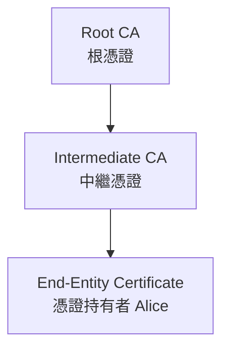

## 引言

當你在網路銀行轉帳、用手機簽署合約、或是看到瀏覽器網址列的小鎖頭時，你可能沒想過:這些「看不見的信任」是怎麼建立的?

在數位世界裡，我們每天都在與陌生人互動，卻能放心地傳送密碼、信用卡號。任何人只要攔截封包，技術上都能看到你的資料。但為什麼我們還是敢用?

因為背後有一套完整的信任機制在運作，這就是 **Public Key Infrastructure（PKI，公開金鑰基礎建設）**。

---

## 為什麼需要加密與信任

在網際網路誕生初期，資料都是直接傳輸的。任何人只要攔截封包，就能看到你的內容。為了解決這個問題，加密技術被引入。

### 對稱加密 vs 非對稱加密

**對稱加密**（如 AES）速度快、實作簡單，但雙方需事先共用密鑰，傳輸過程易被竊取。
**非對稱加密**（如 RSA、ECC）使用公鑰與私鑰一對。公鑰可公開，私鑰保密，無需事先交換秘密，讓安全通訊成為可能。

::LightBoxUrls{:urls='["https://www.ssl2buy.com/wp-content/uploads/2015/12/Symmetric-Encryption.png", "https://www.ssl2buy.com/wp-content/uploads/2015/12/Asymmetric-Encryption.png"]'}
::

---

## 什麼是 PKI、它解決了什麼問題

PKI 的目標是讓每一把公鑰安全地綁定到可驗證的身份上，並透過憑證的建立、管理與撤銷來維持信任。

具體來說，主要負責：

- 建立與發行數位憑證（Digital Certificates）
- 管理憑證的生命周期（簽發、更新、撤銷）
- 確保通訊雙方能安全驗證彼此身份

---

## PKI 的核心角色

為了讓整個系統運作可靠，PKI 涉及幾個重要角色：

- **CA（Certificate Authority）憑證授權單位**
  發行、簽署與撤銷憑證，是信任的來源。

- **RA（Registration Authority）註冊授權單位**
  在發證前驗證申請者身份（像是「CA 的前線審核員」）。

- **Repository（憑證庫與狀態服務）**
  儲存已發行的憑證與 CRL / OCSP 狀態查詢服務。

- **Policy & Procedures（政策與流程）**
  規範誰可以取得什麼憑證、多久更新、如何撤銷，確保運作透明。

---

## PKI 如何運作

讓我們用一個實際場景來理解 PKI 的完整運作流程。

### 場景:Alice 向銀行提交數位簽章合約

#### 1. Alice 取得數位憑證

- 向 CA（如 DigiCert）申請憑證
- RA 驗證身份後，CA 核發包含 Alice 公鑰的憑證
- Alice 的私鑰只保存在自己裝置中

#### 2. Alice 簽署合約

- 用 SHA-256 對合約產生雜湊值
- 用私鑰加密雜湊值產生簽章
- 傳送「合約 + 簽章 + 憑證」給銀行

#### 3. 銀行驗證

**驗證簽章:**

- 用 Alice 的公鑰解密簽章
- 重新計算合約雜湊值並比對 → 確認未被竄改

**驗證憑證信任鏈:**
驗證憑證時,銀行會沿著「信任鏈」逐層檢查(可參考下方「[信任鏈](#信任鏈-chain-of-trust與信任錨trust-anchor)」的圖示說明)。

**檢查憑證狀態:**

- 透過 OCSP/CRL 確認未被撤銷且仍在有效期

#### 4. 驗證完成

✅ 合約由 Alice 本人簽署
✅ 內容未被竄改
✅ 身份經 CA 驗證

---

## PKI 的關鍵細節

### 數位憑證與 X.509 標準

**數位憑證（Digital Certificate）** 是「公鑰的身分證」，遵循 **X.509 標準**。

#### X.509 v3 核心欄位

| 欄位           | 說明                               |
| -------------- | ---------------------------------- |
| **版本**       | 現行多為 v3                        |
| **序號**       | CA 指定的唯一識別碼                |
| **簽章演算法** | 如 sha256WithRSAEncryption         |
| **發行者**     | 發出憑證的 CA 名稱                 |
| **有效期間**   | 起迄日期（Not Before / Not After） |
| **主體**       | 憑證持有者識別名稱                 |
| **主體公鑰**   | 公鑰演算法與內容                   |

> 常見 v3 延伸欄位像是
> Key Usage、SAN（Subject Alternative Name）...等等，可參考 [RFC 5280](https://datatracker.ietf.org/doc/html/rfc5280)。

---

### 信任鏈 （Chain of Trust）與信任錨（Trust Anchor）

驗證憑證時，系統不會直接只信任 Alice 的憑證，而是沿著「信任鏈」逐層驗證:

最上層的 **Root CA** 是整條信任鏈的起點，也就是所謂的 **Trust Anchor**。
只要信任這個根憑證，其簽發的所有下層憑證都能被信任。

> 💡 **例子**：
> 當你打開一個 HTTPS 網站時，瀏覽器其實會驗證這整條鏈，最終確認根 CA 是否在根憑證（root certificate）中。

**為什麼需要 Intermediate CA？**

- Root CA 的私鑰非常敏感，通常離線保存
- 由 Intermediate CA 處理日常簽發，即使 Intermediate CA 被入侵，也只需撤銷該層級，不影響 Root CA
- 提供更靈活的憑證管理架構

---

### 憑證狀態檢查（CRL vs OCSP）

即使憑證在有效期內，也可能因為私鑰洩漏或組織撤銷而失效。PKI 提供兩種主要方式來檢查憑證狀態:

| 方式     | 全名                               | 運作方式                                        | 優缺點                                        |
| -------- | ---------------------------------- | ----------------------------------------------- | --------------------------------------------- |
| **CRL**  | Certificate Revocation List        | CA 定期發佈「已撤銷憑證清單」，客戶端下載後檢查 | ✅ 簡單可靠 ❌ 清單可能很大、更新不即時   |
| **OCSP** | Online Certificate Status Protocol | 即時向 CA 查詢單張憑證狀態                      | ✅ 即時、輕量 ❌ 依賴網路連線、有隱私疑慮 |

> 💡 多數現代瀏覽器使用 OCSP 為主，若查詢失敗會暫時信任憑證，以避免影響使用體驗。

---

## 公開 PKI vs 私有 PKI

PKI 可以分為兩大類，適用於不同場景:

| 類型         | 用途                        | CA 來源           | 範例                                                |
| ------------ | --------------------------- | ----------------- | --------------------------------------------------- |
| **公開 PKI** | 對外服務、公開網站 HTTPS    | 公開信任的商業 CA | Let's Encrypt、DigiCert、GlobalSign                 |
| **私有 PKI** | 企業內部認證、VPN、裝置管理 | 企業自建的內部 CA | Active Directory Certificate Services、OpenSSL 自簽 |

### 何時使用私有 PKI?

- 企業內部員工登入認證
- IoT 裝置間的相互驗證
- 內部系統的 TLS 加密
- VPN 連線憑證管理

私有 PKI 的優勢是完全自主控管，但缺點是只有信任該 CA 的系統才能驗證憑證。

---

## 誰來監督 CA?

既然 CA 是信任的來源，那「誰來確保 CA 不會濫用權力」?

### CA 的監管機制

1. **CA/Browser Forum**
   - 由 CA 與瀏覽器廠商共同制定的規範
   - 定義 CA 的運作標準、稽核要求

2. **瀏覽器廠商的信任清單**
   - Chrome、Firefox、Safari 等各自維護「信任的根 CA」清單
   - CA 必須通過嚴格稽核才能被加入

3. **獨立稽核與認證**
   - CA 需定期通過 WebTrust 或 ETSI 等國際稽核
   - 證明其運作符合安全標準

4. **Certificate Transparency（CT）**
   - 所有公開簽發的憑證都必須記錄在公開日誌
   - 任何人都能監控是否有可疑的憑證簽發

---

## PKI 的應用

你可能每天都在使用，只是你沒有察覺到的 PKI:

- 🔒 HTTPS：確保網站真實性與傳輸加密
- 📧 S/MIME 郵件簽章與加密
- 🧾 文件與程式碼簽署（PDF、App）
- 🧠 IoT 與企業身份驗證（VPN、內網登入）

---

## 延伸與實務補充

### 想親眼看看 PKI?

在 Chrome 或 Edge 瀏覽器中:

1. 點網址列左邊的鎖頭/設定 Icon
2. Chrome: 選「已建立安全連線」→「憑證有效」
   Edge: 選「連線安全」→ 點選「顯示憑證」Icon
3. 你就能看到該網站的憑證、發行 CA、信任鏈等資訊。

### 常見加密與簽章演算法

| 類型       | 常見的算法              | 特點                                         |
| ---------- | ----------------------- | -------------------------------------------- |
| 對稱加密   | AES                     | 速度快、適合大量資料                         |
| 非對稱加密 | RSA、ECC（如 P‑256）    | 安全但較慢、適合小資料                       |
| 簽章演算法 | RSA‑PSS、ECDSA、Ed25519 | 使用私鑰簽署雜湊值、用公鑰驗證，具不可否認性 |
| 雜湊演算法 | SHA‑256、SHA‑3          | 不可逆、固定長度指紋                         |

> 💡 不同場景會選擇不同演算法組合，沒有萬能解法，只有最合適的搭配。

### 🧠 為什麼會有這麼多種演算法?

#### 運算資源差異（效能 vs 安全）

| 場景                       | 需求           | 常見選擇                  |
| -------------------------- | -------------- | ------------------------- |
| 手機、IoT 裝置（資源有限） | 低功耗、計算快 | ECC（如 P-256， Ed25519） |
| 伺服器、企業系統           | 安全優先       | RSA-2048、RSA-4096        |
| 高安全要求（政府、軍用）   | 長期抗量子風險 | SHA-3、Ed448              |

#### 用途不同（加密、簽章、驗證）

| 類別                        | 目的                   | 為何不能共用                       |
| --------------------------- | ---------------------- | ---------------------------------- |
| 對稱加密（AES）             | 快速保護資料內容       | 需要雙方共用密鑰，不適合開放傳輸   |
| 非對稱加密（RSA/ECC）       | 用於密鑰交換或身份認證 | 計算慢，不適合大量資料             |
| 簽章演算法（ECDSA/Ed25519） | 驗證來源與完整性       | 與加密用途不同，重點是「不可否認」 |
| 雜湊演算法（SHA-256）       | 建立不可逆指紋         | 只用來檢查完整性，不具加密性       |

> 💡 **舉例來說，在 HTTPS 連線中，通常會同時使用多種算法:**
>
> 用 RSA/ECDHE 建立金鑰交換（非對稱） 
> 用 AES 進行實際資料傳輸（對稱） 
> 用 SHA-256 驗證訊息完整性（雜湊） 
> 這三種算法會一起出現在 TLS 的 cipher suite 裡。

---

## 結論

加密讓資料能安全傳輸，但「信任」才是安全能被實現的關鍵。

PKI 不只是憑證、技術，而是利用公鑰、私鑰的公開金鑰加密方式，來保障網路上資訊安全性的基礎流程架構。它讓我們能在看不見彼此的網路世界裡，仍然放心地交換資訊、簽署文件、建立連線。

在這個「身份即安全」的時代，**PKI 是數位信任的基石，也是加密能發揮力量的前提。**

---

## 參考資料

- [Wikipedia: Public Key Infrastructure](https://en.wikipedia.org/wiki/Public_key_infrastructure)
- [IDManagement.gov: Public Key Infrastructure 101](https://www.idmanagement.gov/university/pki/)
- [Okta: What Is Public Key Infrastructure](https://www.okta.com/identity-101/public-key-infrastructure/)
- [Keyfactor: What is PKI?](https://www.keyfactor.com/education-center/what-is-pki/)
- [CA/Browser Forum Baseline Requirements](https://cabforum.org/baseline-requirements-documents/)
