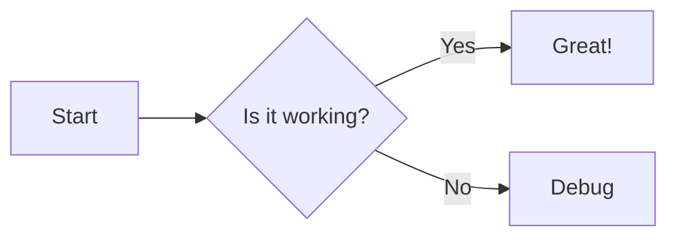

`nuxt-content-mermaid` 是一個把 Mermaid fenced code blocks 轉成 lazy-loaded、可跟隨主題切換的 Nuxt Content 模組。它把 Markdown 轉換、client-side render 與主題整合封裝起來，讓內容作者能直接在技術文件裡寫 Mermaid。

## 專案簡介

主要功能是整合 [**Nuxt Content v3**](https://content.nuxt.com/docs/getting-started) 跟 [**Mermaid**](https://mermaid.js.org/) 的模組。
能自動將 Markdown 中的 \`\`\`mermaid 區塊轉換為響應式的圖表元件，並支援 Lazy Loading、深淺色模式切換、工具列，以及可平移縮放的放大檢視。

如果你想看這個模組在完整內容系統裡的定位，可以繼續閱讀 [透過 Nuxt Content v3 與 i18n 建立可長期維護的雙語內容網站](/zh/posts/nuxt-content-v3-i18n-bilingual-site/)。那篇文章講整體架構，這一頁則專注在 Mermaid 整合本身。

## 解決的問題

在 Nuxt Content 中，Mermaid 通常需要自己處理「Markdown 解析 → 轉換 → 客戶端載入 Mermaid → render」這整段流程，還要顧及：

- SSR 與 Hydration（Mermaid 只能在 client 端 render）
- 多張圖表同頁渲染時的穩定性與效能
- 深色/淺色主題切換
- Mermaid 提供許多讓使用者設定的選項，但要在 Nuxt Content 中實作並不直觀

此模組把上述工作封裝成「內容轉換 + Runtime 元件」，讓使用者只需要專注在 Markdown 內容本身。

## 功能特色

- **自動轉換**：在 `content:file:beforeParse` 階段把 Mermaid fenced code block 轉為 `<Mermaid>`。
- **Lazy Loading**：預設用 `IntersectionObserver`，元件進入 viewport 才載入 Mermaid 並 render。
- **主題整合**：若專案安裝 `@nuxtjs/color-mode`，會自動依 `dark/light` 切換 Mermaid 主題；也支援 `useMermaidTheme()` 手動控制。
- **互動工具列**：提供複製原始碼、全螢幕與放大檢視按鈕。
- **放大與導覽**：支援全螢幕/放大檢視，並可對大型圖表進行平移與縮放。
- **可客製元件**：可指定自訂 renderer / spinner / error component。
- **Runtime Config**：支援從 `runtimeConfig.public.contentMermaid` 傳遞嚴格的純資料設定，並在每個 Nuxt 應用程式初始化時解析一次。
- **Frontmatter**：可在文章 frontmatter 中設定 `config` 屬性，覆寫該篇文章的 Mermaid 設定；同時必須在 collection schema 宣告為 object。
- **TypeScript 支援**：模組與元件皆有完善的 TypeScript 定義。
- **測試覆蓋**：使用 Vitest 撰寫單元測試，確保模組穩定性。

## 相容版本

v3 支援 Nuxt `^4.1.0`、Nuxt Content `>=3.5.0 <4.0.0`，以及 Node.js `>=22.19.0`。

## 工作原理簡單示意

````mermaid
---
toolbar:
  title: nuxt-content-mermaid Basic Flow
---
flowchart TD
  MD["在 Markdown 寫下<br><b>```mermaid</b> 區塊"] --> Hook["Nuxt Content hook<br/><b>content:file:beforeParse</b>"]
  Hook --> Comp["輸出 <Mermaid> 元件"]
  Comp --> Plugin["client plugin 提供 $mermaid()"]
  Plugin --> Import["dynamic import('mermaid')"]
  Import --> Render["mermaid.run() 產生 SVG"]
````

## 快速使用

1. 安裝：

```bash
pnpm add @barzhsieh/nuxt-content-mermaid @nuxt/content
```

1. 加到 `nuxt.config.ts`：

```ts
export default defineNuxtConfig({
  modules: ['@barzhsieh/nuxt-content-mermaid'],
  contentMermaid: {
    enabled: true,
    loader: {
      lazy: true,
      init: { securityLevel: 'strict' },
    },
    theme: { light: 'default', dark: 'dark' },
    toolbar: {
      buttons: { copy: true, fullscreen: true, expand: true },
    },
    expand: { enabled: true },
  },
})
```

1. 在 Markdown 直接寫 Mermaid：

````md

```mermaid
graph LR
  A[Start] --> B{Is it working?}
  B -- Yes --> C[Great!]
  B -- No --> D[Debug]
```
````

## 支持專案

如果這個模組對你有幫助，歡迎透過 Ko-fi 支持我持續維護。

[](https://ko-fi.com/barzhsieh){target="\_blank" rel="noopener"}

## 外部連結

- NPM：[https://www.npmjs.com/package/@barzhsieh/nuxt-content-mermaid](https://www.npmjs.com/package/@barzhsieh/nuxt-content-mermaid){:target="\_blank"}
- GitHub：[https://github.com/andy820621/nuxt-content-mermaid](https://github.com/andy820621/nuxt-content-mermaid){:target="\_blank"}
